# Building an End-to-End AI Agent: Claude Code+ MCP + AWS Bedrock + Confluence for Enterprise Knowledge Discovery

*Turn your company's endless docs into a smart search system that answers questions like a human.*

## Prerequisites
- [Install python 3.11](https://www.python.org/downloads/windows/)
- [Install gitbash](https://git-scm.com/install/windows)
- [Install Claude desktop](https://claude.com/download)
- Need to create a `local IAM user` and give `AdministratorAccess` permission.


 <!-- Table of Contents - Steps 1-9
- [Building an End-to-End AI Agent: MCP + AWS Bedrock + Confluence for Enterprise Knowledge Discovery](#building-an-end-to-end-ai-agent-mcp--aws-bedrock--confluence-for-enterprise-knowledge-discovery)
  - [Let's Talk About a Real Problem](#lets-talk-about-a-real-problem)
  - [The Big Headache: Too Many Docs, No Easy Way to Find Them](#the-big-headache-too-many-docs-no-easy-way-to-find-them)
  - [The Fix: An AI Brain for Your Docs](#the-fix-an-ai-brain-for-your-docs)
  - [Step-by-Step: Let's Build This Thing](#step-by-step-lets-build-this-thing)
    - [Step 1: Get Your Confluence Space Ready](#step-1-get-your-confluence-space-ready)
    - [Step 2: Get Your API Token](#step-2-get-your-api-token)
    - [Step 3: Hook Up MCP to Confluence](#step-3-hook-up-mcp-to-confluence)
    - [Step 4: Make a Knowledge Base in AWS Bedrock](#step-4-make-a-knowledge-base-in-aws-bedrock)
    - [Step 5: Secure Your Credentials with AWS Secrets](#step-5-secure-your-credentials-with-aws-secrets)
    - [Step 6: Pick Your AI Models and Storage](#step-6-pick-your-ai-models-and-storage)
    - [Step 7: Sync and Index Your Docs](#step-7-sync-and-index-your-docs)
    - [Step 8: Test It Out](#step-8-test-it-out)
    - [Step 9: Add It to Your IDE](#step-9-add-it-to-your-ide)
  - [The Tech Behind This](#the-tech-behind-this)
    - [🔧 Model Context Protocol (MCP)](#-model-context-protocol-mcp)
    - [☁️ AWS Bedrock](#️-aws-bedrock)
    - [📚 Confluence](#-confluence)
    - [🔍 Vector Stuff](#-vector-stuff)
  - [Why This Matters in Real Life](#why-this-matters-in-real-life)
    - [⏱️ Saves Time](#️-saves-time)
    - [📈 Gets More Done](#-gets-more-done)
    - [🔧 Grows with You](#-grows-with-you)
    - [🤖 Smart Answers](#-smart-answers)
  - [Quick Fixes and Tips](#quick-fixes-and-tips)
    - [Common Problems:](#common-problems)
    - [Make It Better:](#make-it-better)
  - [Wrapping Up](#wrapping-up) -->


## Let's Talk About a Real Problem

Working in a big company sucks sometimes, especially when it comes to finding stuff. We've got docs everywhere—Confluence pages from old acquisitions, random wikis, shared drives full of architecture diagrams and notes. I remember wasting hours trying to find out how to run a Spark job or who won last month's award. It's frustrating, right?

What if you could just ask your computer a question like "Hey, how do we submit Spark jobs?" and get a straight answer with links to the right docs? That's what we're building today. I'll show you how to set up an AI system using MCP, AWS Bedrock, and Confluence. It's not rocket science, and it could save your team tons of time.

By the end, you'll have something that handles thousands of docs and gives smart answers. Let's get started.

## The Big Headache: Too Many Docs, No Easy Way to Find Them

Big companies like ours have this issue:
- **Way too many files**: Thousands of pages from different companies we've bought
- **Stuff scattered everywhere**: Docs hidden in Confluence, old wikis, and random folders
- **Wasting time searching**: Engineers asking each other "Where's that diagram?" all day
- **Old info everywhere**: You never know if what you're reading is up to date

Normal search just doesn't cut it. You need something smarter that gets what you're asking and points you to the source.

## The Fix: An AI Brain for Your Docs

We're using something called RAG (Retrieval-Augmented Generation) to make your docs searchable:

1. **Break down your docs**: Split Confluence pages into bite-sized pieces
2. **Turn text into math**: Convert words into vectors for smart matching
3. **Ask in plain English**: No weird search terms needed
4. **Get real answers**: Smart replies with links to the original docs

The main tools we'll use:
- **Confluence MCP Server**: Connects directly to your Confluence
- **AWS Bedrock Knowledge Bases**: Handles the AI and storage for you
- **Cursor IDE**: A code editor that works with MCP for testing

## Step-by-Step: Let's Build This Thing

### Step 1: Get Your Confluence Space Ready

We need some test docs first.

1.1. **Sign up for Confluence**:
   - Go to [Confluence](https://www.atlassian.com/software/confluence)
   - Use your `Gmail` or `other email id` to sign up
   - Make a new space for playing around

1.2. **Add some test pages**:
   - Hit the "+" button → "Page"
   - Make 4-5 dummy docs about:
     - AWS Environment Overview
     - Terraform Infrastructure as Code (IaC)
     - CI/CD Pipeline Architecture
     - Rules for data platformsEKS Cluster Operations Guide
     - AWS Cost Optimization & Governance

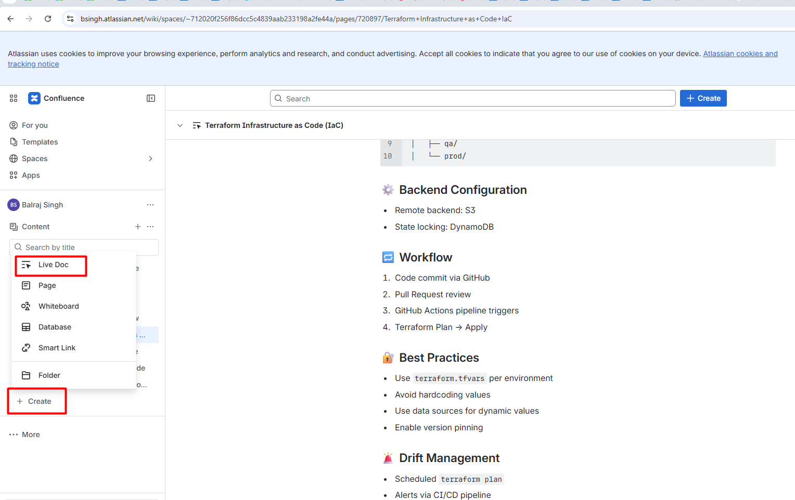
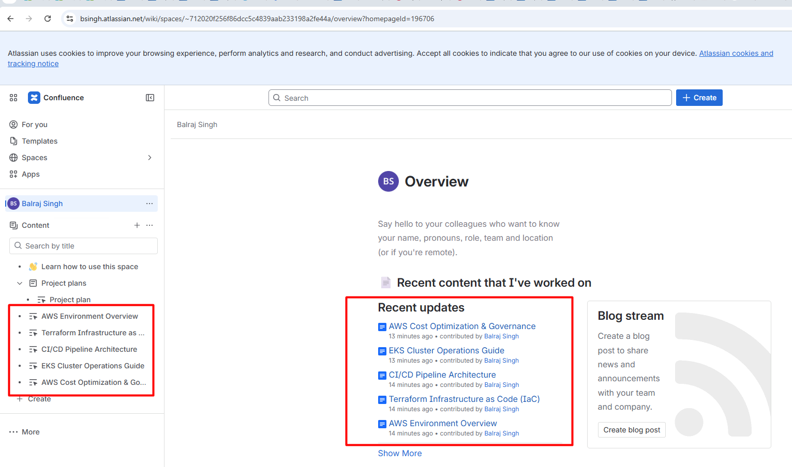

   > [!IMPORTANT]
   Use made-up content so you don't share real company secrets. 

   > [!NOTE] 
   I use below prompt to create dummy page for me in confluence. if you are not sure how to create content in confluence then use the below prompt in `chatgpt`.
    *"I want to create a confluence page and I am looking for content. help me to create a 5 confluence page. give me complete information"*
   
### Step 2: Get Your API Token

To let the AI talk to Confluence, you need a token.

2.1. Go to [id.atlassian.com/manage-profile/security/api-tokens](https://id.atlassian.com/manage-profile/security/api-tokens)

2.2. Click "Create API token"
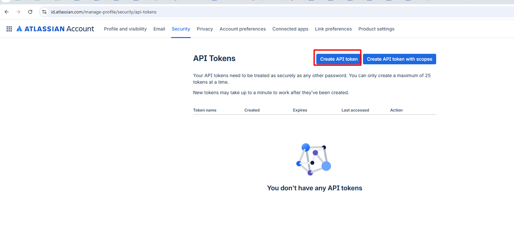
2.3. Name it something like "AI Docs Search"
2.4. Pick when it expires
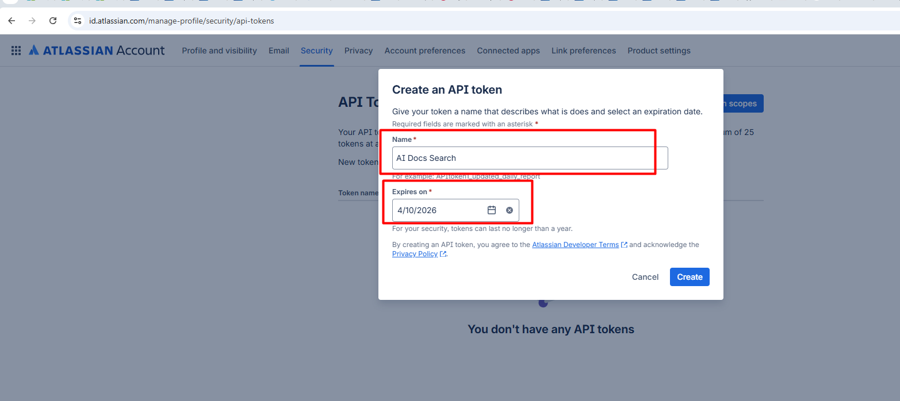
2.5. **Save it somewhere safe** - you'll need it soon
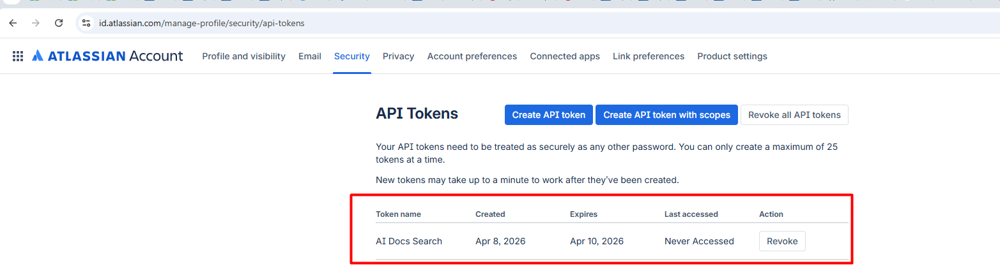

### Step 3: Install `claude Desktop` 
#### Step 3.1: Installtion

- Download Claude desktop[https://claude.com/download]
- Login with your email.

### Step 4: Install `Python 3.11` 

- Install [Python](https://www.digitalocean.com/community/tutorials/install-python-windows-10)

### Step 5: Install `MCP Server` 
- [What is MCP Server](https://modelcontextprotocol.io/docs/getting-started/intro)
- List of [MCP Servers](https://github.com/modelcontextprotocol/servers)
- Add the [Atlassian MCP server](https://github.com/sooperset/mcp-atlassian)

- Install MCP Server
  - Install directly with pip for development or when you need the package in your Python environment:
    ```bash
    pip install mcp-atlassian
    ```
  - Run the server
    ```sh
    mcp-atlassian --help
    ```
  - Verify uv packages
    ```sh
    uv --version
    ```
> [!NOTE]
> If uv is not installed then run: `pip install uv`
  
  - Verify MCP server locally 
    ```sh
    uvx mcp-atlassian
    ```
- [x]  I am getting below error message. 

 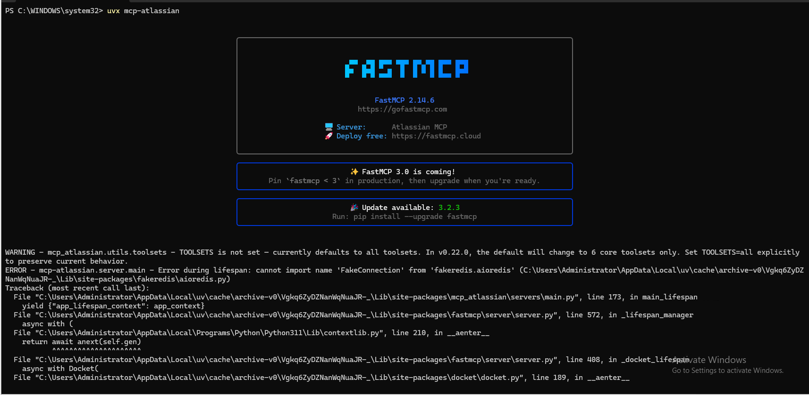

> [!IMPORTANT]
> 
> Ran this to fix the MCP Server
> 
> Step 1️⃣ Undo the broken state (clean slate)
>  
    pip install --force-reinstall "fakeredis>=2.32.1,<2.33" "redis>=5"
  
>  Step 2️⃣ Force uvx to use the correct fakeredis version
> 
    uvx --with "fakeredis==2.32.1" --with "redis>=5" mcp-atlassian
  
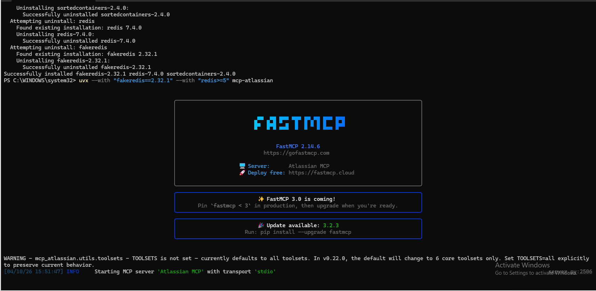

### Step 6: Configure MCP server in claude desktop

Let's connect your claude desktop to MCP Server.

6.1. **Set up local MCP**:
   - Open Claude desktop and click on your profile and select the `setting`
   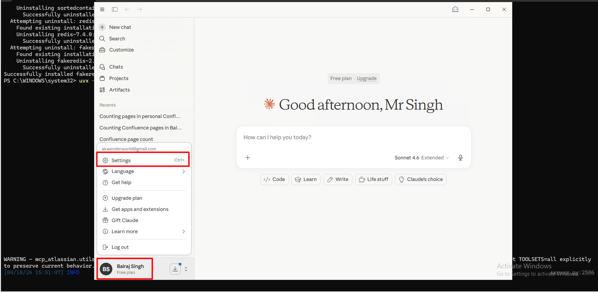
  - Click on developer | edit Configuration
  
    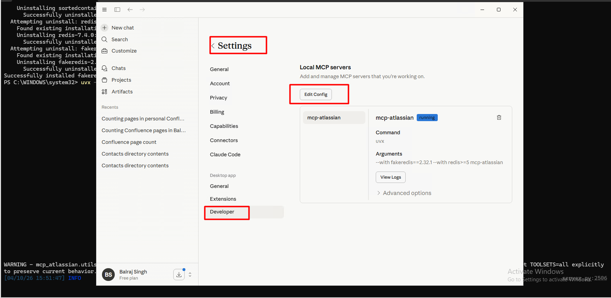

  - Open the `claude_desktop_config` file in notepad editor and make it following entry
     
     - Paste the following json content in `claude_desktop_config.json `file and save it.
 
   ```bash
    {
    "mcpServers": {
      "mcp-atlassian": {
        "command": "uvx",
        "args": [
          "--with",
          "fakeredis==2.32.1",
          "--with",
          "redis>=5",
          "mcp-atlassian"
        ],
        "env": {
          "CONFLUENCE_URL": "https://Yourname.atlassian.net/wiki",
          "CONFLUENCE_USERNAME": "your-email@company.com",
          "CONFLUENCE_API_TOKEN": "your_api_token"
          }
        }
      }
    }
   ```
  - Update your details as below:
      - `Confluence URL` (check your Confluence site)
      - `Username`: Your email
      - `Password`: That token generated in step 2 

> [!IMPORTANT]  
> See [Authentication](https://mcp-atlassian.soomiles.com/docs/authentication) for details.

6.2. **Restart claude Desktop**
   - VERY IMPORTANT:
     - Close `claude Desktop` completely
     - Open task manager and close claude if running.
     - Reopen it
     
6.3.  **Verify Local MCP server is running fine in Claude**:

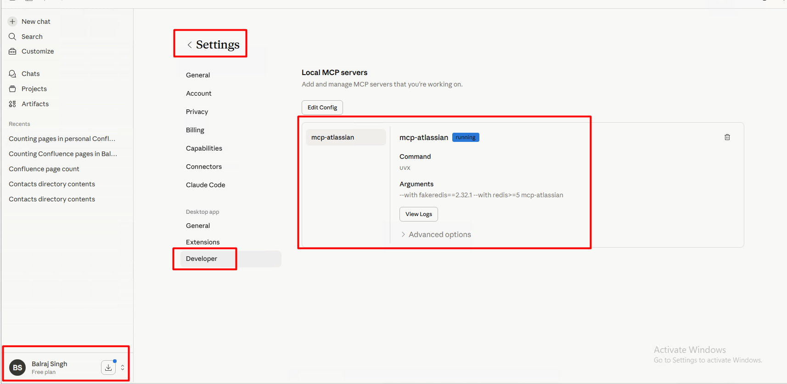

6.4. **Try it out**:
- Ask something like 
   
🔍 Example prompts:

     - "List my Confluence pages" 
     - "Search Confluence for "AWS"
     - "How many pages do I have in Confluence?"
     - You should get back titles, spaces, and page IDs
     - Using Confluence, list the last 5 pages I modified
     - Search Confluence for pages containing "API"
     - How many pages exist in my Confluence space?
  ```shell
     - Using Confluence, generate a weekly report with:

      Number of pages created
      Number of pages updated
      Titles of updated pages
      Page authors
   ```

*If it works without errors, you're good.*
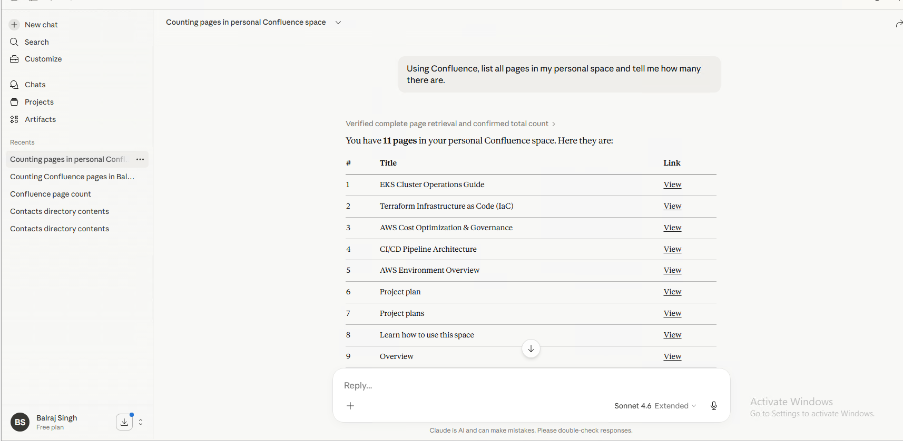
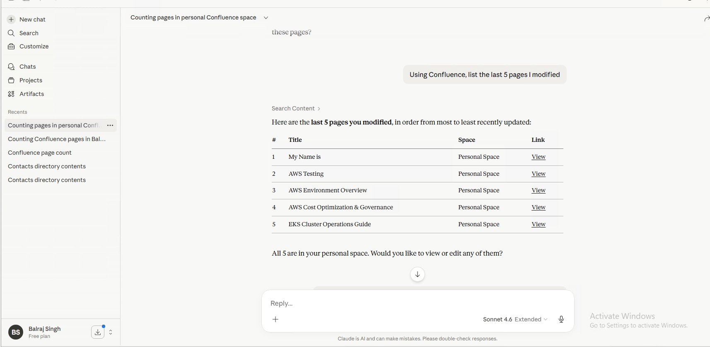


### Step 7: Make a Knowledge Base in AWS Bedrock

For lots of docs, Bedrock does the heavy lifting.

7.1. **Go to AWS Bedrock Console**:
   - Find the "Build" section
   - Click "Knowledge bases"

 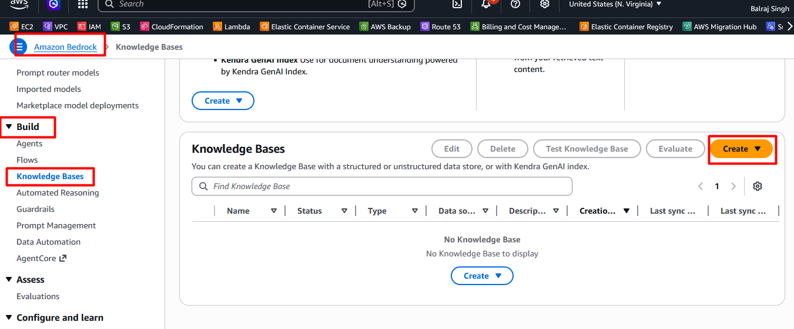

7.2. **Create a new one**:
   - Click "Create knowledge base with vector store"
   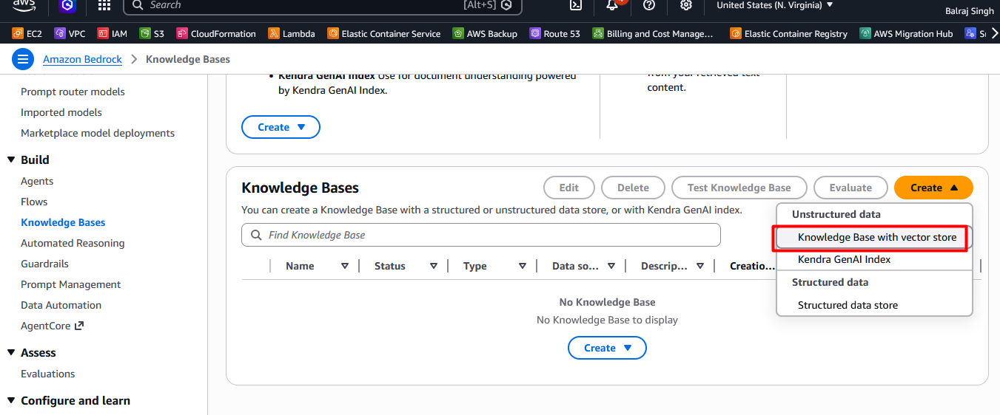
   - Name it like "Company_Docs_Brain"
   - Pick or make an IAM role for Bedrock
   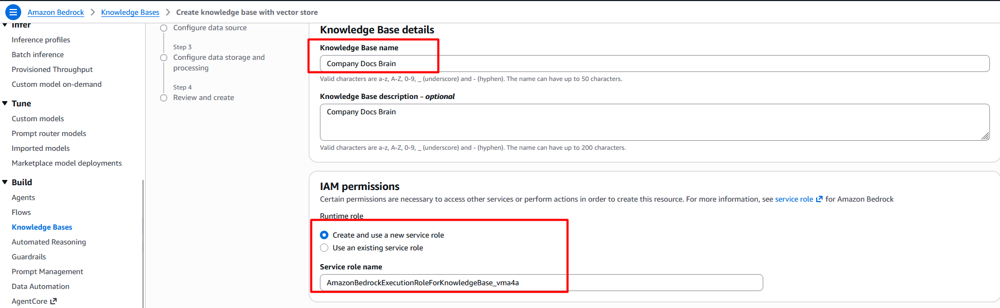

7.3. **Set up the data source**:
   - Choose "Confluence"
   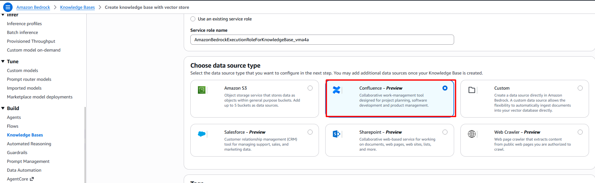
   - Click On Next
   - Add your Confluence URL <https://Yourname.atlassian.net>
   - Tag it for easy finding
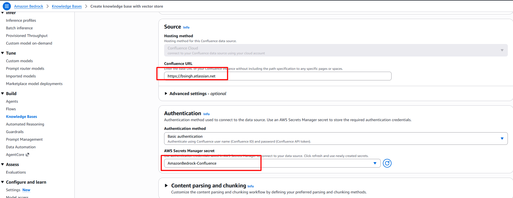

### Step 8: Secure Your Credentials with AWS Secrets

Bedrock needs safe access to Confluence.

8.1. **Open AWS Secrets Manager**
8.2. **Make a new secret**:
   - Name must start with "AmazonBedrock-" (super important!) i.e "AmazonBedrock-Confluence"
   - Save as key-value:
   - username: Your Confluence email
   - password: Your token
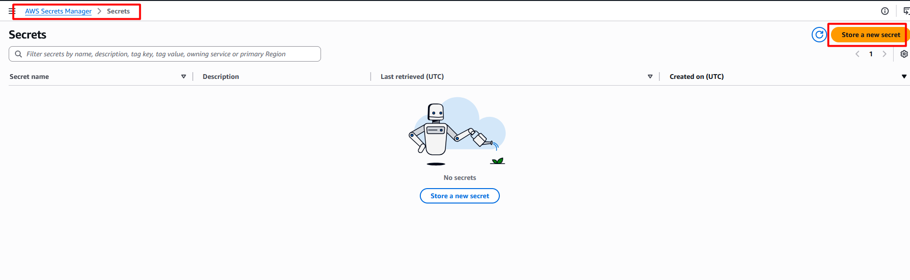
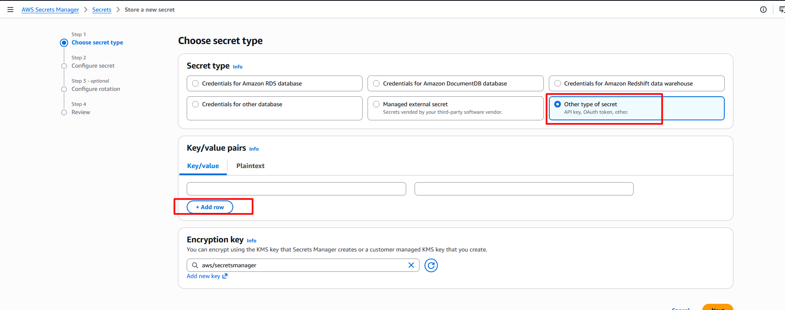
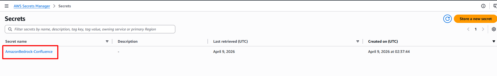
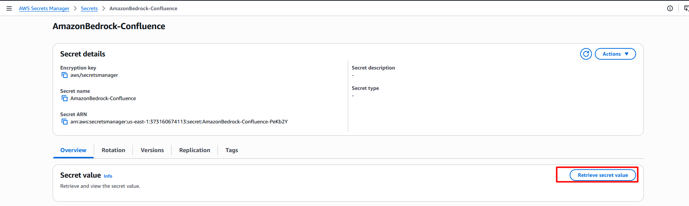

8.3. **Grab the ARN**
8.4. **Back in Bedrock**:
   - Pick "Basic authentication"
   - Paste that ARN

### Step 9: Pick Your AI Models and Storage

Choose what powers your search.

9.1. **Embedding model**:
   - Go with Amazon `Titan Text Embedding V2`
   - It turns your docs into searchable vectors
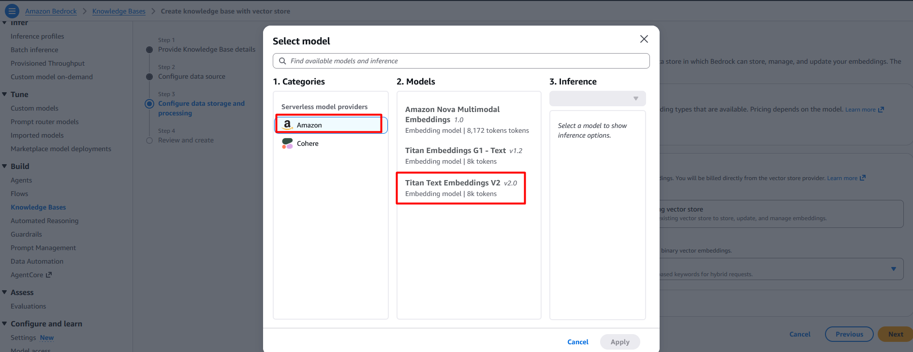

9.2. **Vector store**:
   - **Amazon OpenSearch Serverless**: Easy and scales
   - **Amazon S3 Vectors**: Cheap for big data
   - **Pinecone** or **Redis**: Other options
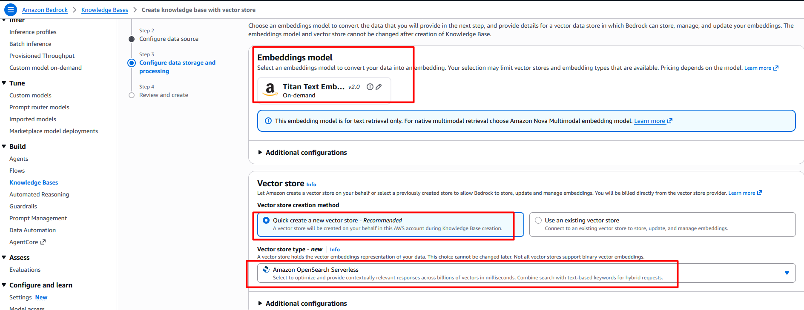

9.3. **Finish up**:
   - Check everything
   - Hit "Create"
   - Wait 5-10 minutes

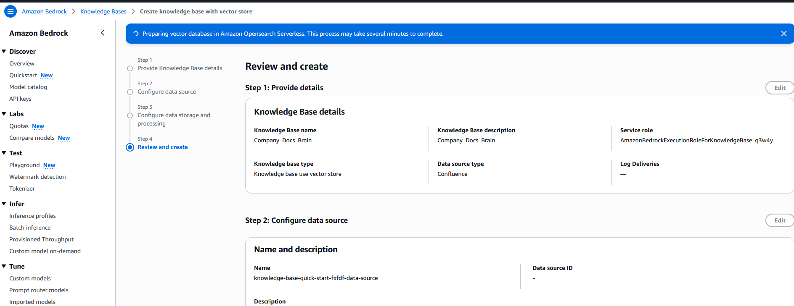

> [!IMPORTANT]
> Don't refresh the page else you have to create the whole thing again.

>  [!WARNING] 
> I am getting below error message as I was using root credentail to login. So, we have to create local IAM user first and follow the same steps 5 to 7 again.
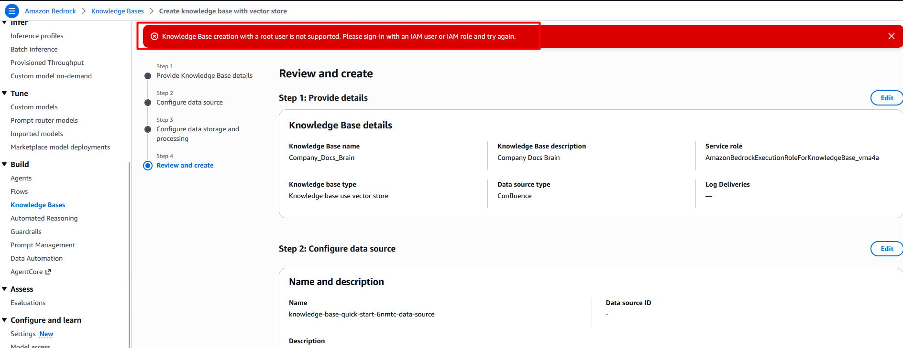

### Step 10: Sync and Index Your Docs

Time to feed the AI.

10.1. **First sync**:
   - Click "Sync" to pull in all Confluence pages
   - It breaks them up and makes vectors
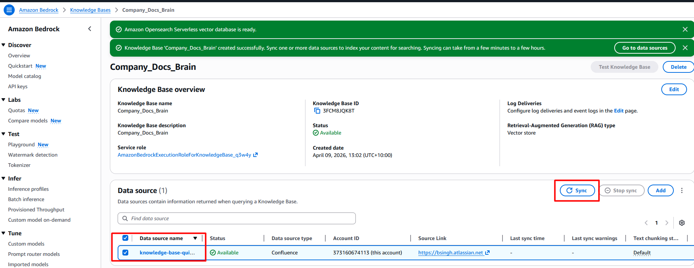

<details><summary><b>Troubleshooting</b></summary><br>
I was getting below error message because I had given wrong key value in seceret manager

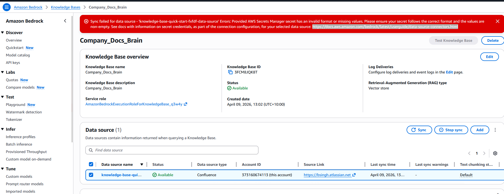

- #### Fix:
   - I was using Username and Password, while it should be `username` and `password` all are in lower letter.
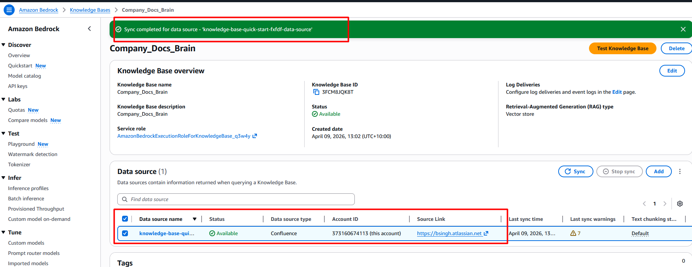

</details>


10.2. **Watch it**:
   - Should say "Available" when done
   - Check the link for more info

### Step 11: Test It Out

Make sure it works.

11.1. **In Bedrock console**:
   - Click "Test knowledge base"
   - Pick any model
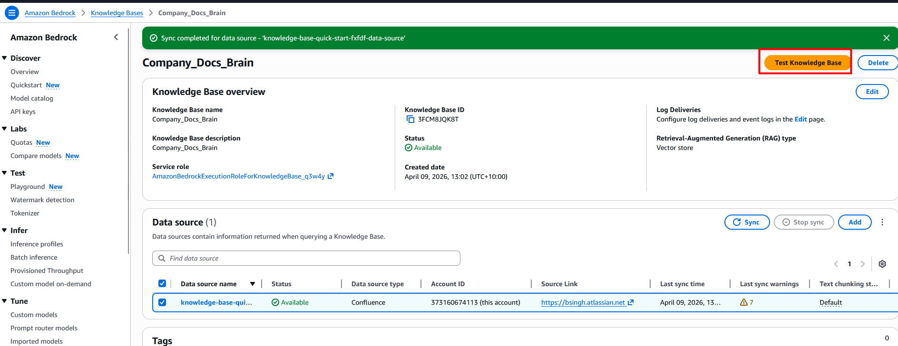
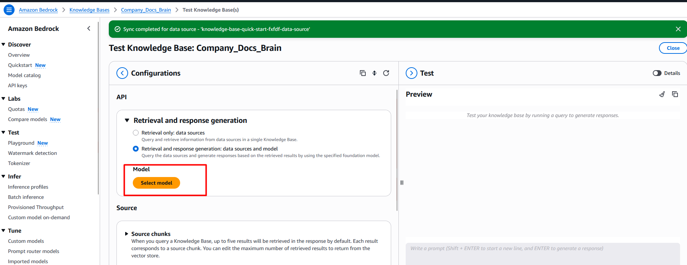
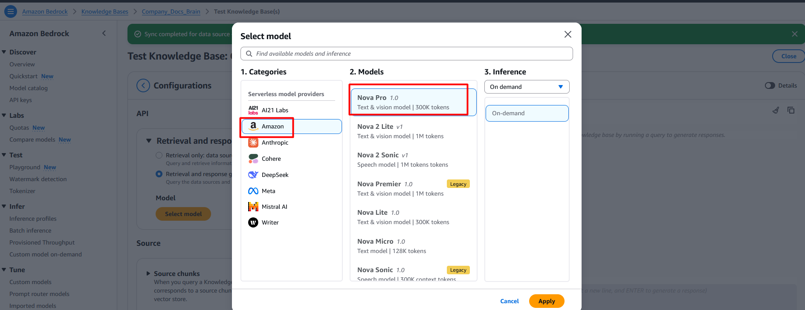

   - Ask questions like:
   🔍 Example prompts:

    - 👉 Search Confluence for "AWS"
    - 👉 What is the AWS architecture model
  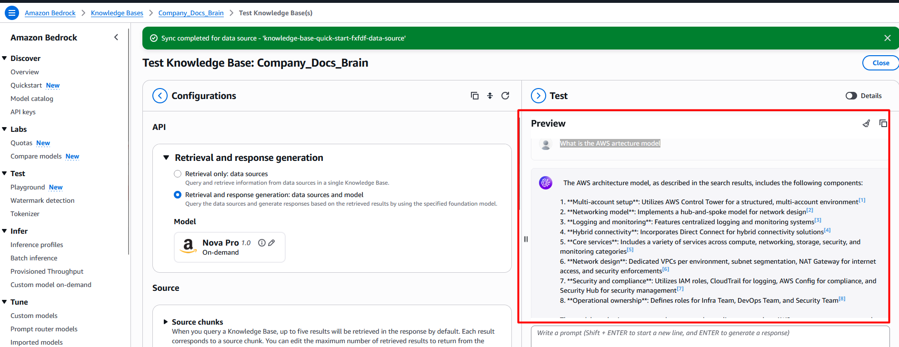

11.2. **What you should get**:
   - Good answers with links
   - Points to original pages
   - Makes sense

### Step 12: Add it to Your daily task

Bring it into your daily work.

12.1. **Add Bedrock MCP Server**:
   - In IDE, add "AWS Bedrock KB Retriever"
   - Set up with your AWS stuff
```sh
{
  "mcpServers": {
    "mcp-atlassian": {
      "command": "uvx",
      "args": ["mcp-atlassian"],
      "env": {
        "CONFLUENCE_URL": "https://yourname.atlassian.net/wiki",
        "CONFLUENCE_USERNAME": "youremailID@gmail.com",
        "CONFLUENCE_API_TOKEN": "NEW_TOKEN_HERE"
      }
    },
    "awslabs.bedrock-kb-retrieval-mcp-server": {
      "command": "uvx",
      "args": ["awslabs.bedrock-kb-retrieval-mcp-server@latest"],
      "env": {
        "AWS_PROFILE": "your-profile-name",
        "AWS_REGION": "us-east-1",
        "FASTMCP_LOG_LEVEL": "ERROR",
        "KB_INCLUSION_TAG_KEY": "optional-tag-key-to-filter-kbs",
        "BEDROCK_KB_RERANKING_ENABLED": "false"
      },
      "disabled": false,
      "autoApprove": []
    }
  }
}
```

12.2. **Ask away**:
   - Try "Who won awards and what for?"
   - Should pull from your knowledge base

## The Tech Behind This

This uses some cool modern stuff:

### 🔧 Model Context Protocol (MCP)
- **What is it**: A way for AI to grab data from outside
- **Why care**: Lets tools like Cursor talk to Confluence easily
- **Big deal**: Makes AI tools work everywhere

### ☁️ AWS Bedrock
- **What is it**: AWS handles AI models and search for you
- **Cool parts**:
  - Knowledge Bases auto-index docs
  - Many embedding models (Titan, Cohere, etc.)
  - Vector storage options
- **Why use it**: No servers to manage, grows with you, fits AWS

### 📚 Confluence
- **What is it**: Company wiki for docs
- **AI upgrade**: Turns boring pages into smart answers
- **Good for**: Keeps your usual workflow but adds brains

### 🔍 Vector Stuff
- **OpenSearch Serverless**: Like Elasticsearch but managed
- **Titan Embeddings**: AWS turns text into vectors
- **RAG**: Mixes finding docs with making answers

## Why This Matters in Real Life

This isn't just fun—it's useful:

### ⏱️ Saves Time
- Search in seconds, not hours
- No more "Who has that doc?" chats

### 📈 Gets More Done
- Devs get quick answers
- New people learn faster
- Better choices with fresh info

### 🔧 Grows with You
- Handles tons of docs
- Auto-updates new stuff
- Works across Confluence spaces

### 🤖 Smart Answers
- Ask normally ("How to run Spark?")
- Gets context and sources
- Combines info from many docs

## Quick Fixes and Tips

### Common Problems:
- **Token expires**: Make a new one
- **Permissions**: Check IAM for Bedrock and Secrets
- **Sync fails**: Verify Confluence login

### Make It Better:
- **Chunk size**: Tweak how docs are split
- **Models**: Try different embeddings
- **Cache**: Save answers for common questions

> [!CAUTION]
> Please ensure that all AWS resources created during this process are properly deleted once they are no longer needed. This will help avoid any unnecessary charges.

## Wrapping Up

You just made an AI that turns your docs from a mess into a superpower. Mixing MCP, AWS Bedrock, and Confluence gives you a system that answers questions fast, links to sources, grows big, and fits into coding.

This changes how companies use knowledge. Picture everyone asking your shared brain instead of hunting for docs.

Want to try this at your place? Follow the steps and see what happens.

*Got questions? Tell me in the comments!*


---
> [!IMPORTANT] Ref Link

- [Youtube]
    - [VSCode + Cline + Continue | NEVER PAY for CURSOR again. Use this OPEN SOURCE & LOCAL Alternative](https://www.youtube.com/watch?v=7AImkA96mE8)
    - [How to Install Claude Code on Windows](https://www.youtube.com/watch?v=Geq6RCYTSFA)

    - [How to Install Claude AI desktop on Windows](https://www.youtube.com/watch?v=M_ydtJW3_Pw)

    - [Atlassian’s MCP server with VS Code ](https://www.youtube.com/watch?v=pXAih3jAOcc)
    - [Connect to Confluence for your knowledge base](https://docs.aws.amazon.com/bedrock/latest/userguide/confluence-data-source-connector.html)
    - [Bedrock-kb-retrieval-mcp-server](https://github.com/awslabs/mcp/tree/main/src/bedrock-kb-retrieval-mcp-server)
    - [AWS-Adding AWS Profiles in Visual Studio Code](https://medium.com/@Lokeshrajeshbabu/aws-adding-aws-profiles-in-visual-studio-code-eee7483505f6)
    - [AWS Profiles in Visual Studio Code](https://aws.amazon.com/video/watch/962722ff987/)
    
    - https://www.youtube.com/watch?v=wPgI6kxGnHw
    - http://youtube.com/watch?v=ql1MIvohHqE
    - https://github.com/modelcontextprotocol
    - https://nodejs.org/en/download
---

<!-- *Posted on Hashnode first. Hit me up on LinkedIn for more AI and cloud tips.*

#AI #MachineLearning #AWS #Bedrock #Confluence #MCP #RAG #EnterpriseAI #KnowledgeManagement #DevOps -->


