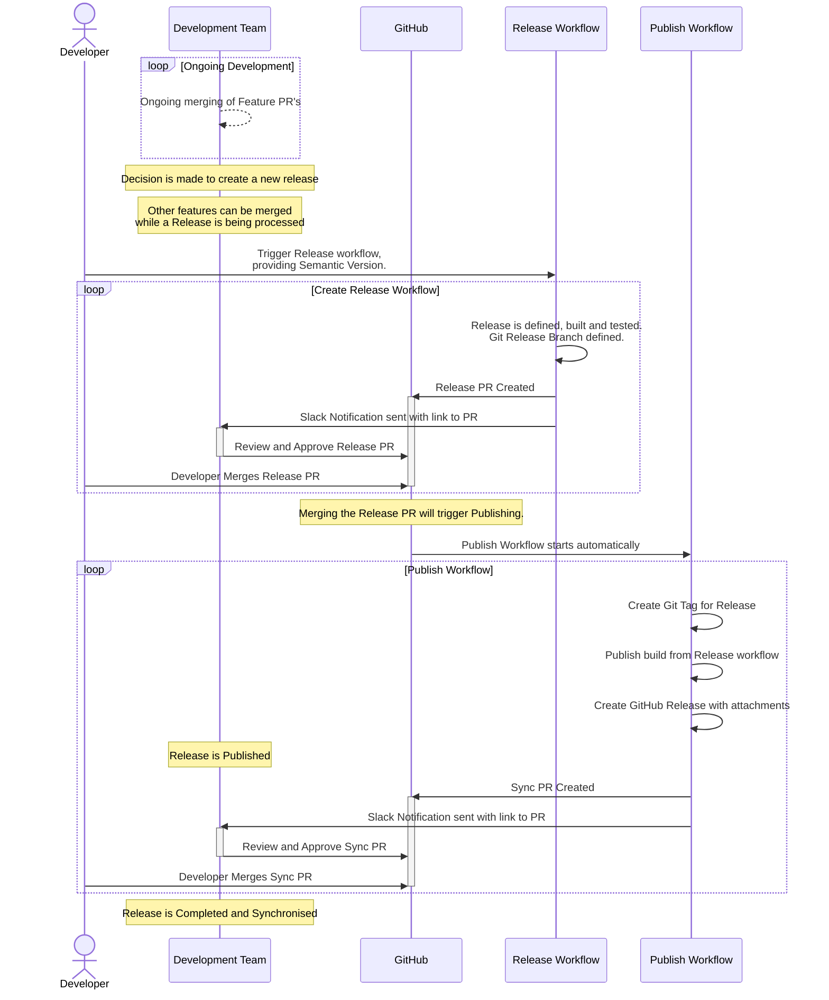
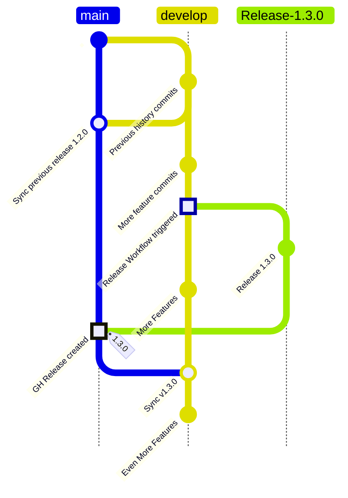
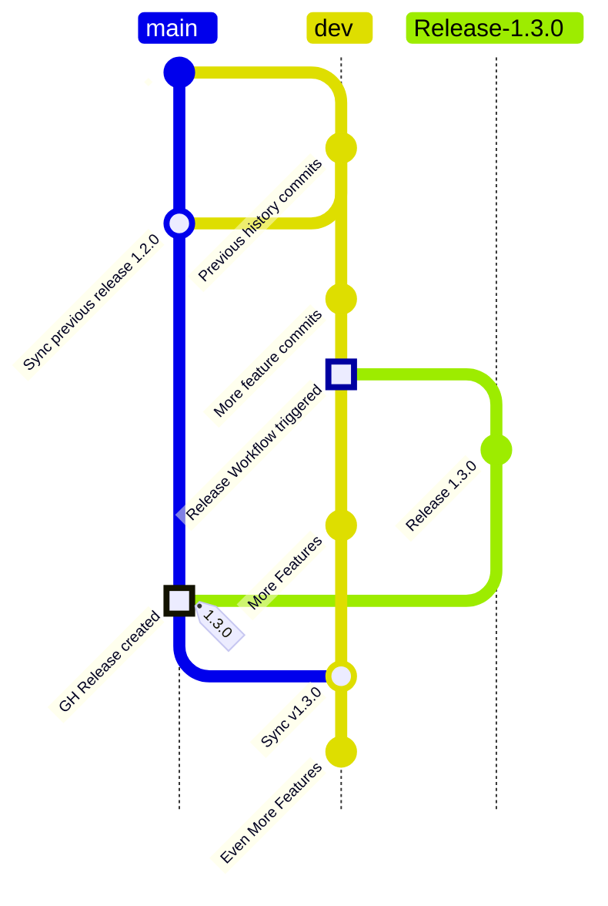

### Example Sequence Diagram for Release Process

```mermaid
  sequenceDiagram
    Actor Developer
    participant Team as Development Team
    participant GitHub
    participant Release as Release Workflow
    participant Sync as Publish Workflow
    
    %% This is ongoing development over time, between releases.
    loop Ongoing Development
    Team-->>Team: Ongoing merging of Feature PR's
    end

    %% Anyone in the team can decide that a Release should be made (not just Devs)
    Note over Team: Decision is made to create a new release
    Note over Team: Other features can be merged<br>while a Release is being processed

    Developer->>Release: Trigger Release workflow,<br>providing Semantic Version.
    loop Create Release Workflow
    Release->>Release: Release is defined, built and tested.<br>Git Release Branch defined.
    Release->>GitHub: Release PR Created
    activate GitHub
    Release->>Team: Slack Notification sent with link to PR
    activate Team
    Team->>GitHub: Review and Approve Release PR
    deactivate Team
    Developer->>GitHub: Developer Merges Release PR
    deactivate GitHub
    end
    Note over GitHub: Merging the Release PR will trigger Publishing.
    GitHub->>Sync: Publish Workflow starts automatically
    loop Publish Workflow
    Sync->>Sync: Create Git Tag for Release
    Sync->>Sync: Publish build from Release workflow
    Sync->>Sync: Create GitHub Release with attachments
    note over Team: Release is Published
    Sync->>GitHub: Sync PR Created
    activate GitHub
    Sync->>Team: Slack Notification sent with link to PR
    activate Team
    Team->>GitHub: Review and Approve Sync PR
    deactivate Team
    Developer->>GitHub: Developer Merges Sync PR
    deactivate GitHub
    end
    note over Team: Release is Completed and Synchronised
```

### Example Sequence Diagram for Release Process

```mermaid
  gitGraph TB:
     commit id: " "
     branch develop
     commit id: "Previous history commits"
     checkout main
     merge develop id: "Sync previous release 1.2.0"
     checkout develop
     commit id: "More feature commits"
     commit id: "Release Workflow triggered" type: HIGHLIGHT
     branch Release-1.3.0
     commit id: "Release 1.3.0"
     checkout develop
     commit id: "More Features"
     checkout main
     merge Release-1.3.0 id: "GH Release created" type: HIGHLIGHT tag: "1.3.0"
     checkout develop
     merge main id: "Sync v1.3.0"
     commit id: "Even More Features"
```
# Second Diagram:

```mermaid
  gitGraph TB:
     commit id: " "
     branch dev
     commit id: "Previous history commits"
     checkout main
     merge dev id: "Sync previous release 1.2.0"
     checkout dev
     commit id: "More feature commits"
     commit id: "Release Workflow triggered" type: HIGHLIGHT
     branch Release-1.3.0
     commit id: "Release 1.3.0"
     checkout dev
     commit id: "More Features"
     checkout main
     merge Release-1.3.0 id: "GH Release created" type: HIGHLIGHT tag: "1.3.0"
     checkout dev
     merge main id: "Sync v1.3.0"
     commit id: "Even More Features"
```

# Third Diagram:

```mermaid
  gitGraph TB:
     commit id: " "
     branch dev
     commit id: "Previous history commits"
     checkout main
     <!-- checkout main
     merge dev id: "Sync previous release 1.2.0"
     checkout dev
     commit id: "More feature commits"
     commit id: "Release Workflow triggered" type: HIGHLIGHT
     branch Release-1.3.0
     commit id: "Release 1.3.0"
     checkout dev
     commit id: "More Features"
     checkout main
     merge Release-1.3.0 id: "GH Release created" type: HIGHLIGHT tag: "1.3.0"
     checkout dev
     merge main id: "Sync v1.3.0"
     commit id: "Even More Features" -->
```