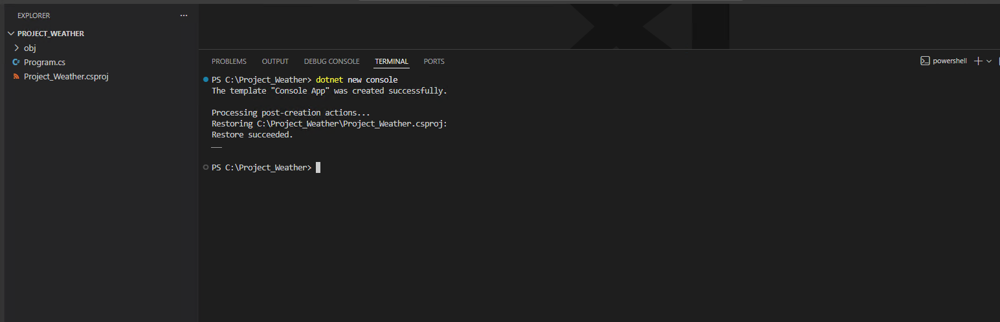
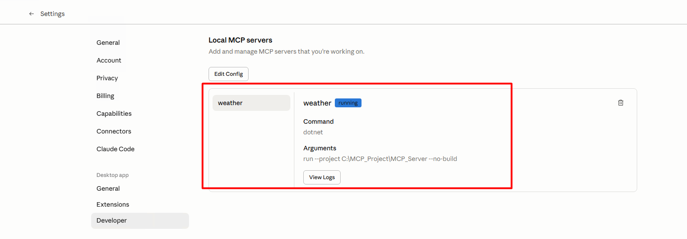
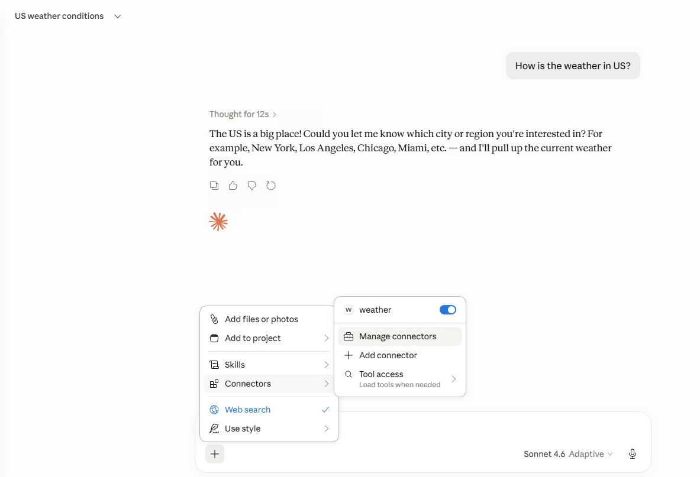
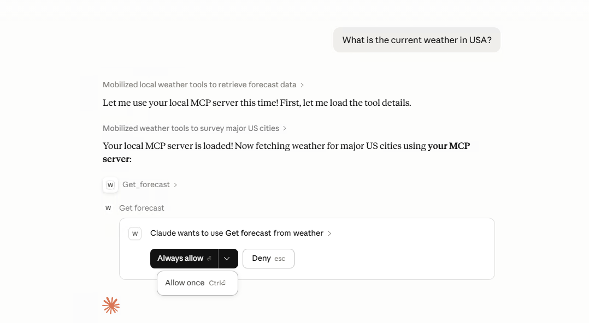

*Environment Setup*
· Provision a single Windows Server 2025 Base, *c5.xlarge* VM on AWS
OR
· Use your laptop/desktop

·** Download**
- .NET 8 SDK or higher
- Visual Studio Code
- Claude for Desktop
- Install
  - .NET 8 SDK or higher
    - Confirm that the dotnet version is above 8
  - Run command : dotnet -- version
- Visual Studio Code
  - Install C# dev Extension
- Claude for Desktop


**Create and set up your project**

· Create a new directory for our project
  - mkdir weather
  - cd weather

· Initialize a new C# project
```shell
dotnet new console
```
· Open the project in VS Code

· Add the Model Context Protocol SDK NuGet package
dotnet add package ModelContextProtocol -- prerelease

· Add the .NET Hosting NuGet package
dotnet add package Microsoft.Extensions.Hosting




- After running dotnet new console, you will be presented with a new C# project

Run the following command as is.
# Add the Model Context Protocol SDK NuGet package
dotnet add package ModelContextProtocol --prerelease
# Add the .NET Hosting NuGet package
dotnet add package Microsoft.Extensions.Hosting


## Build Server

- Open the Program.cs
- Copy the code from the [reference URL](https://modelcontextprotocol.io/docs/develop/build-server#c%23)
- Copy the class to manage JSON requests to Program.cs
- Copy the Weather Tools APIs
- Start the Server using dotnet run to listen for requests using stdio

Note : Copy the code from the reference URL


**Connect and Test with Claude for Desktop**

-  Create claude_desktop_config.json at
`"C:\Users\ << username>>\AppData\Roaming\Claude"`
- Copy configuration to add MCP Servers to the config file
- Exit Claude desktop completely [*File menu and exit*] and restart
- **As per the MCP protocol's requirement check that the tools are visible on
the UI**
- Test the weather tools






Reference URLs:
- [dotnet](https://dotnet.microsoft.com/en-us/download/dotnet/thank-you/sdk-8.0.420-windows-x64-installer)
- [vscode](https://code.visualstudio.com/)
- [Claude Desktop](https://claude.com/download)
- [MCP Server](https://modelcontextprotocol.io/docs/develop/build-server)

- [YouTube Video](https://www.youtube.com/watch?v=4SnHsAO9s_U&list=PLrDJzKfz9AUvJ6LipcrxWZmMZDY2z_Tkj&index=4)