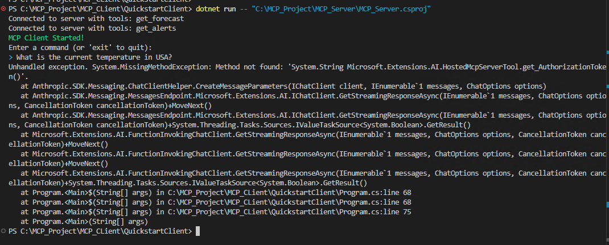

Scenario

Build an LLM-powered chatbot client that connects to an MCP server to fetch the
forecast and severe weather alerts using server tools:
GetAlerts
GetForecast

We'll connect this MCP client using standard I/O (stdio) transport to an MCP
server

Note :

1. Go through Part 4 - Build Server that guides you through the basics of
building your first server that you can connect with your client

2. I already have my server up and running as per the steps in Part 4 - Build
Server


Environment Setup
· Provision a single Windows Server 2025 Base, c5.xlarge VM on AWS
OR
· Use your laptop/desktop

· Download
. .NET 8 SDK or higher
· Visual Studio Code

· Install
· .NET 8 SDK or higher
Confirm that the dotnet version is above 8
Run command : dotnet -- version
· Visual Studio Code
Install C# dev Extension

.

.

Note : I have completed these steps


Create and set up your project

· Create a new directory for our project
· mkdir mcpClient
· cd mcpClient

· Initialize a new C# project
· dotnet new console -n QuickstartClient
· cd QuickstartClient

· Open the project in VS Code

· Add required dependencies
· dotnet add package ModelContextProtocol -- prerelease
· dotnet add package Anthropic.SDK
· dotnet add package Microsoft.Extensions.Hosting
· dotnet add package Microsoft.Extensions.Al


Get an Anthropic API Key

· Go to https://console.anthropic.com/settings/keys
· Sign in
· Create an API Key for individual evaluation
· Copy the key in a notepad
· Add your key to user secrets
· dotnet user-secrets init
· dotnet user-secrets set "ANTHROPIC_API_KEY" "<your key here>"

Note :

1. Key will only be displayed once so copy and save it
2. Anthropic does NOT provide FREE access for evaluation purposes


**Build and Run the Client**

· Setup basic client class
· Open the Program.cs
. Copy the code from the reference URL to create the basic client class
and read the API Key from user secrets
· Copy the code to setup the MCP Client
. Server is running on the same machine as the client. Hence this client
will connect with the server using stdio transport.
· Hence create the command to run the server
. Copy the copy for processing queries and handling tool calls
· Run the client using dotnet run -- << path/to/server.csproj >>

Note : Copy the code from the reference URL

Error:



Fix

```

Reference Doc:
- https://modelcontextprotocol.io/docs/develop/build-client#c%23
Reference URLS

. https://dotnet.microsoft.com/en-us/download

. https://code.visualstudio.com/

. https://console.anthropic.com/

· https://modelcontextprotocol.io/quickstart/client