# Self-Hosted Infrastructure Automation: Terraform MCP + Claude Code + Local Ollama Setup on Ubuntu 22.04 LTS

## 📌 Introduction

Many developers want to use AI coding assistants like **Claude Code**, but paid subscriptions are often a barrier. This project demonstrates how to use **Claude Code completely FREE** by integrating it with **Ollama** and a cloud-hosted AI model (**Minimax M2.7**), directly inside **VS Code**.

With this setup, you can:
- Build landing pages, apps, and MVPs
- Use AI as a real coding agent
- Avoid cloud usage fees and subscriptions
  
**My Stack:**

- 🐧 Ubuntu 22.04 LTS
- 🐳 Docker
- 🏗️ Terraform
- ☁️ AWS CLI
- 💻 VS Code with Claude Code Extension

---

## 📋 Prerequisites Checklist

Before we start, make sure you have:

- [ ] Ubuntu 22.04 LTS running
- [ ] Internet connection (for downloads)
- [ ] Sudo access on your machine
- [ ] ~5GB free disk space (for Docker images + dependencies)
- [ ] Terraform Cloud account (for API token)
- [ ] AWS account (optional, but recommended for testing)

---

## 🔧 Step 1: Update Your System

Always start fresh. Update package lists and upgrade existing packages:

```bash
sudo apt update
sudo apt upgrade -y
```

This ensures you have the latest security patches and package versions.

**Expected time:** 5-10 minutes

---

## 🐳 Step 2: Install Docker

### 2.1 Remove old Docker versions (if any)

```bash
sudo apt remove docker docker-doc docker.io containerd runc -y
```

This cleans up any existing Docker installations that might conflict.

### 2.2 Install Docker's dependency packages

```bash
sudo apt install ca-certificates curl gnupg lsb-release -y
```

These are required for secure Docker installation.

### 2.3 Add Docker's GPG key

```bash
sudo mkdir -p /etc/apt/keyrings
curl -fsSL https://download.docker.com/linux/ubuntu/gpg | sudo gpg --dearmor -o /etc/apt/keyrings/docker.gpg
```

This verifies that packages come from Docker's official repository.

### 2.4 Set up Docker's APT repository

```bash
echo \
  "deb [arch=$(dpkg --print-architecture) signed-by=/etc/apt/keyrings/docker.gpg] https://download.docker.com/linux/ubuntu \
  $(lsb_release -cs) stable" | sudo tee /etc/apt/sources.list.d/docker.list > /dev/null
```

This adds Docker's official Ubuntu repository.

### 2.5 Install Docker Engine

```bash
sudo apt update
sudo apt install docker-ce docker-ce-cli containerd.io docker-buildx-plugin docker-compose-plugin -y
```

**What we're installing:**
- `docker-ce`: Docker Community Edition (the main engine)
- `docker-cli`: Command-line interface
- `containerd.io`: Container runtime
- `docker-compose-plugin`: For multi-container setups

### 2.6 Add user to the Docker group

```bash
sudo usermod -aG docker $USER
```

This allows you to run Docker commands without `sudo`.

### 2.6 Refresh user permission to the Docker group

```bash
newgrp docker
```

> [!IMPORTANT]
If abobe doesn't work then log out and log back in (or restart) for this to take effect.

### 2.7 Verify Docker Service

After installation, verify that Docker is running:

```bash
docker --version
```

**Expected output:**
```
Docker version 25.x.x (or newer)
```

**If Docker is not running, start it manually:**

```bash
sudo systemctl start docker
```

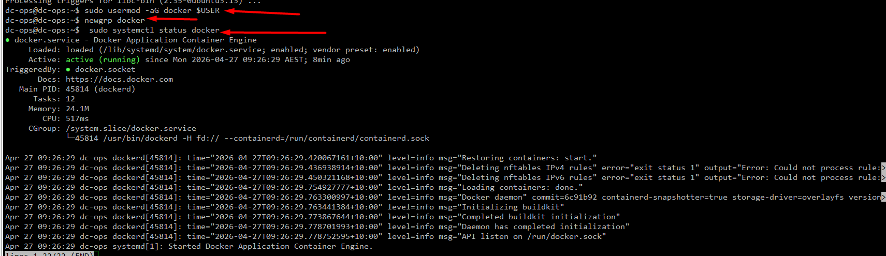

---

## 🏗️ Step 3: Install Terraform

### 3.1 Add HashiCorp's GPG key

```bash
curl -fsSL https://apt.releases.hashicorp.com/gpg | sudo apt-key add -
```

### 3.2 Add the official HashiCorp repository

```bash
curl -fsSL https://apt.releases.hashicorp.com/gpg | \
sudo gpg --dearmor -o /usr/share/keyrings/hashicorp-archive-keyring.gpg


echo "deb [signed-by=/usr/share/keyrings/hashicorp-archive-keyring.gpg] \
https://apt.releases.hashicorp.com $(lsb_release -cs) main" | \
sudo tee /etc/apt/sources.list.d/hashicorp.list
```

### 3.3 Install Terraform

```bash
sudo apt update
sudo apt install terraform -y
```

### 3.4 Verify installation

```bash
terraform --version
```

**Expected output:**
```
Terraform 1.14.x (or newer)
```


### 3.5 (Optional) Enable shell tab‑completion
```bash
terraform -install-autocomplete
source ~/.bashrc
```

---

## 🧠 Step 4: Install Ollama (Local LLM)

### 4.1 What is Ollama?

Ollama lets you run large language models locally on your machine. No cloud dependencies, no API costs, no internet required for inference. Perfect for development and testing without hitting rate limits.

### 4.2 Download and install Ollama

```bash
curl -fsSL https://ollama.ai/install.sh | sh
```

This script handles everything—dependencies, permissions, and service setup.

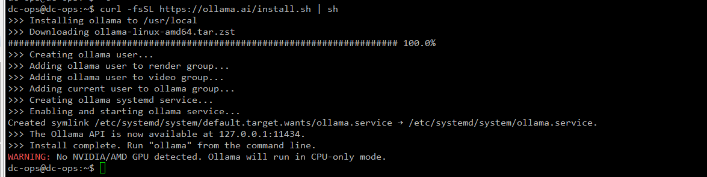

### 4.3 Verify installation

```bash
ollama --version
```

**Expected output:**
```
ollama version is 0.21.x
```

### 4.4 Start Ollama service

Ollama runs as a system service. Check if it's running:

```bash
systemctl status ollama
```

If not running, start it:

```bash
sudo systemctl start ollama
```

Enable it to start on boot:

```bash
sudo systemctl enable ollama
```

### 4.5 Verify Ollama is accessible

```bash
curl http://localhost:11434/api/tags
```
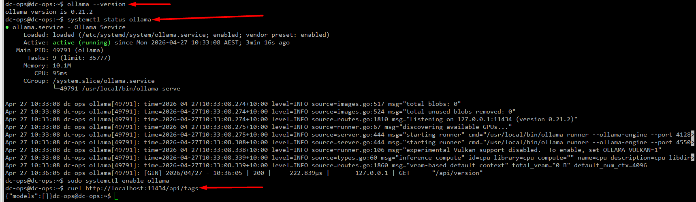

### 4.6 Restart the Ollama service:

```Shell
ollama stop
ollama serve
```

You should get a response (might be empty if no models yet). This confirms Ollama's API is running.

---

## 🤖 Step 5: Pull the Qwen 3.5 Cloud Model

### 5.1 What is Qwen 3.5 Cloud?

Qwen 3.5 Cloud is Alibaba's open-source LLM—fast, capable, and designed for local inference. It's a solid alternative to Claude for infrastructure code, with good understanding of Terraform and IaC concepts.

**Model specs:**
- Parameter size: Lightweight (optimized for local)
- Training data: Up to early 2024
- Best for: Code generation, Terraform, scripting, technical writing

### 5.2 Pull the model

```bash
ollama pull qwen3.5:cloud
```

This downloads the model to your local machine. 
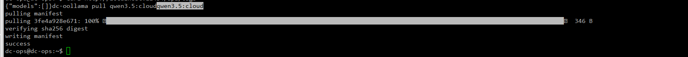

**⏱️ Expected time:** 5-15 minutes (depends on internet speed)  
**Storage needed:** ~2-4GB

**What you'll see:**
```
pulling manifest
pulling eff9c14a6fb3
pulling a1db8f7e7a86
...
success
```

### 5.3 Verify the model is ready

```bash
ollama list
```

You should see `qwen3.5:cloud` in the output:

```
NAME                  ID              SIZE      MODIFIED
qwen3.5:cloud         abc1234def56    2.2GB     1 minutes ago
```
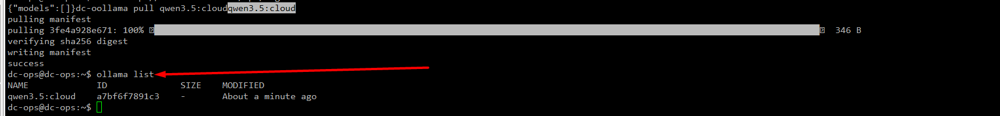

### 5.4 Sign in to Ollama using the CLI

**5.4.1. Run the login command**
```Shell
ollama login
```

**5.4.2. Complete browser authentication**

After running the command, Ollama will:

- Open your **default web browser**, or <br>
- Display a **URL** to open manually

- You’ll be asked to:

  - Sign in with your Ollama account (GitHub / Google / email)
  - Approve CLI access

✅ Once approved, the CLI session is authenticated automatically.

**5.4.3. Verify you’re signed in**
Run:
```Shell
ollama whoami
```
Example output:
```sh
username@example.com
```

**5.4.4. Run a Cloud model and Test the model locally**
Now Cloud models will work:

Try a quick inference to make sure it's working:

```bash
ollama run qwen3.5:cloud "Write a simple Hello World in Terraform"
```

The model should respond with Terraform code. If it works, you're good to go.

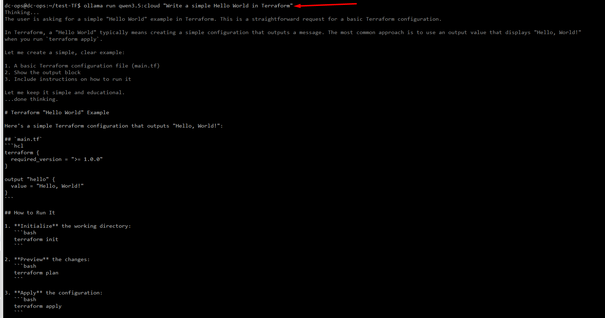
---

## ☁️ Step 6: Install AWS CLI v2

### 6.1 Download AWS CLI installer

```bash
curl "https://awscli.amazonaws.com/awscli-exe-linux-x86_64.zip" -o "awscliv2.zip"
```

### 6.2 Unzip the installer

```bash
unzip awscliv2.zip
```

### 6.3 Run the installer

```bash
sudo ./aws/install
```

### 6.4 Verify installation

```bash
aws --version
```

**Expected output:**
```
aws-cli/2.x.x Python/3.x.x ...
```
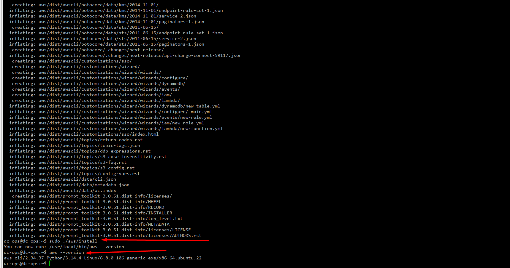

### 6.5 Clean up installer files

```bash
rm -rf awscliv2.zip aws/
```

---

## 🔐 Step 7: Configure AWS Credentials (Optional but Recommended)

If you plan to use AWS with Terraform, configure your credentials:

```bash
aws configure
```

You'll be prompted for:
- **AWS Access Key ID** (from your AWS account)
- **AWS Secret Access Key**
- **Default region** (e.g., `us-east-1`)
- **Default output format** (e.g., `json`)

**Credentials are stored in:** `~/.aws/credentials`

### 7.1 Verify AWS Configuration
```sh
aws configure list
# aws configure list --profile my-profile
aws sts get-caller-identity
```

---

## 🏛️ Step 8: Create Terraform Cloud Token

This is **critical** for the MCP Server to work.

### 8.1 Log in to Terraform Cloud

Go to: https://app.terraform.io/

Create a free account if you don't have one.

### 8.2 Generate an API token

1. Click your profile icon (top-right)
2. Select **"User settings"**
3. Go to **"Tokens"** tab
4. Click **"Create an API token"**
5. Give it a name (e.g., `mcp-server-token`)
6. Copy the token and save it somewhere safe

> [!CAUTION]
*This is sensitive. Treat it like a password.*

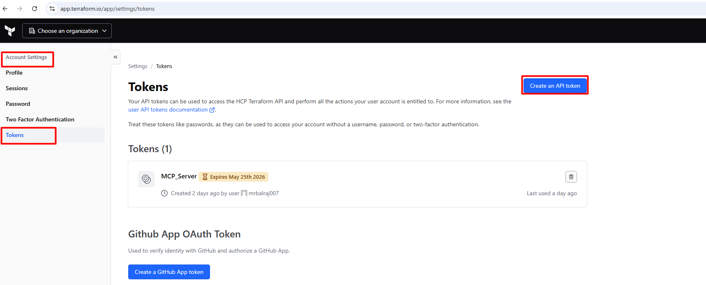
---

## 📝 Step 9: Configure Terraform with Your Token

### 9.1 Create credentials file

```bash
mkdir -p ~/.terraform.d
```

### 9.2 Create credentials configuration

```bash
cat > ~/.terraform.d/credentials.tfrc.json << EOF
{
  "credentials": {
    "app.terraform.io": {
      "token": "YOUR_TOKEN_HERE"
    }
  }
}
EOF
```

**Replace `YOUR_TOKEN_HERE`** with your actual token from Step `8.2`.

```sh
cat /home/dc-ops/.terraform.d/credentials.tfrc.json
ls -la ~/.terraform.d/credentials.tfrc.json
```

### 9.3 Set secure permissions

Terraform requires restrictive permissions on this file:

```bash
chmod 600 ~/.terraform.d/credentials.tfrc.json
```

This ensures only you can read the token.

```bash
ls -la ~/.terraform.d/credentials.tfrc.json
```
Should show: `-rw------- (owner read/write only)`

### 9.4 Verify configuration

```bash
terraform login
```

If configured correctly, you should see:
```
✓ Token saved to ...
```

### 9.5 Test It

Verify Terraform can now authenticate:
```bash
terraform init
```
If it works, you'll see successful provider initialization. If there's a token issue, you'll get a clear `401 error`.

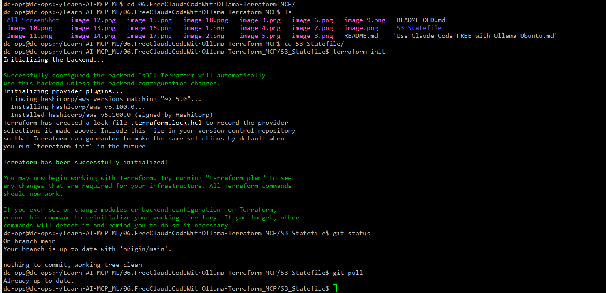
---

## 💻 Step 10: Install VS Code (If Not Already Installed)

**Recommended Method**: Microsoft APT Repository (Best for updates) This installs VS Code directly from Microsoft and keeps it automatically updated. 

### 10.1 Add Microsoft's GPG key

```bash
wget -qO- https://packages.microsoft.com/keys/microsoft.asc | gpg --dearmor > packages.microsoft.gpg
sudo install -D -o root -g root -m 644 packages.microsoft.gpg /etc/apt/keyrings/packages.microsoft.gpg
```

### 10.2 Add VS Code repository

```bash
echo "deb [arch=amd64,arm64,armhf signed-by=/etc/apt/keyrings/packages.microsoft.gpg] https://packages.microsoft.com/repos/code stable main" | \
sudo tee /etc/apt/sources.list.d/vscode.list > /dev/null
```

### 10.3 Install VS Code

```bash
sudo apt update
sudo apt install code -y
```

### 10.4 Verify installation

```bash
code --version
```

```sh
dc-ops@dc-ops:~$ code --version
1.117.0
10c8e557c8b9f9ed0a87f61f1c9a44bde731c409
x64
```
### 10.5 Clean up

```bash
rm packages.microsoft.gpg
```

---

## 🤖 Step 11: Install Claude Code Extension for VS Code

### 11.1 Open VS Code

```bash
code
```

### 11.2 Install the extension

**Option A: Via VS Code UI (Recommended)**

1. Open VS Code
2. Go to **Extensions** (Ctrl+Shift+X)
3. Search for **"Claude Code"**
4. Click **Install** (look for the official Anthropic extension)


**Option B: Via Command Line**

```bash
code --install-extension Anthropic.claude-code
```
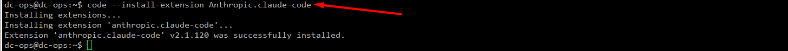

### 11.3 Verify installation

1. Open VS Code
2. Look for the Claude icon in the sidebar
3. You should see the Claude Code panel

---

## 🌉 Step 12: Claude Code Install

**Recommended Method: Native Installer (No Node.js needed)**
This is the official, preferred approach for Ubuntu and is what Anthropic recommends in 2025–2026. It installs Claude Code into your home directory and auto‑updates safely.

**Step 12.1: Update your system**
```Shell
sudo apt update
```

**Step 12.2: Install curl (if not already installed)**
```Shell
sudo apt install -y curl
```
> [!NOTE]
*Desktop Ubuntu usually has curl already, but server/minimal images often don’t.*

**Step 12.3: Run the Claude Code installer**
```Shell
curl -fsSL https://claude.ai/install.sh | bash
```
**Output:**

```sh
root@dc-ops:~# curl -fsSL https://claude.ai/install.sh | bash
Setting up Claude Code...

✔ Claude Code successfully installed!

  Version: 2.1.119

  Location: ~/.local/bin/claude


  Next: Run claude --help to get started

⚠ Setup notes:
  ● Native installation exists but ~/.local/bin is not in your PATH. Run:

    echo 'export PATH="$HOME/.local/bin:$PATH"' >> ~/.bashrc && source ~/.bashrc


✅ Installation complete!

root@dc-ops:~# echo 'export PATH="$HOME/.local/bin:$PATH"' >> ~/.bashrc && source ~/.bashrc
root@dc-ops:~# claude --version
2.1.119 (Claude Code)
root@dc-ops:~#
```
> [!IMPORTANT]
What this does:
>
```sh
Installs the claude binary to ~/.local/bin/claude
Stores versions under ~/.local/share/claude/
Adds ~/.local/bin to your PATH (if needed)
Enables automatic background updates
```
> [!IMPORTANT]
⚠ *Do not use sudo for this command. It must be installed as your normal user.*

**Step 12.4: Verify installation**
```Shell
claude --version
```
If you see a version number, installation succeeded.

If claude: command not found, fix your PATH:
```Shell
echo 'export PATH="$HOME/.local/bin:$PATH"' >> ~/.bashrc && source ~/.bashrc
```

**Step 12.5: Run diagnostics (recommended)**
```Shell
claude doctor
```
This checks network access, binaries, and environment setup.

**Step 12.6:  Pull a Coding‑Capable Model**

Claude Code needs:

- Function calling
- Tool execution
- Large context (64k+ preferred)

**Step 12.7: Recommended starting models**
```Shell
ollama pull qwen3.5:cloud
```

Other strong options:

- glm-5:cloud
- kimi-k2.5:cloud
- minimax-m2.7:cloud

(Local‑only alternatives like qwen2.5-coder work, but tool use may be weaker). 

**Step 12.8: List installed models:**
```Shell
ollama list

dc-ops@dc-ops:~$ ollama list
NAME             ID              SIZE    MODIFIED
qwen3.5:cloud    a7bf6f7891c3    -       3 seconds ago
dc-ops@dc-ops:~$
```

**Step 12.9: One‑Command Launch (Easiest Way)**
This is the recommended and cleanest method.
```Shell
ollama launch claude
```

- Ollama sets all required environment variables
- Claude Code is launched
- Model picker appears
- Claude Code now talks to Ollama, not Anthropic

➡ Choose your model (qwen3.5:cloud, etc.)
Done.
You are now using Claude Code with Ollama

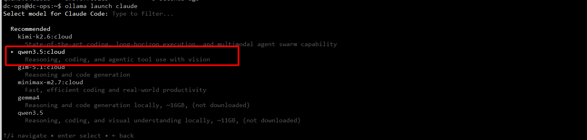
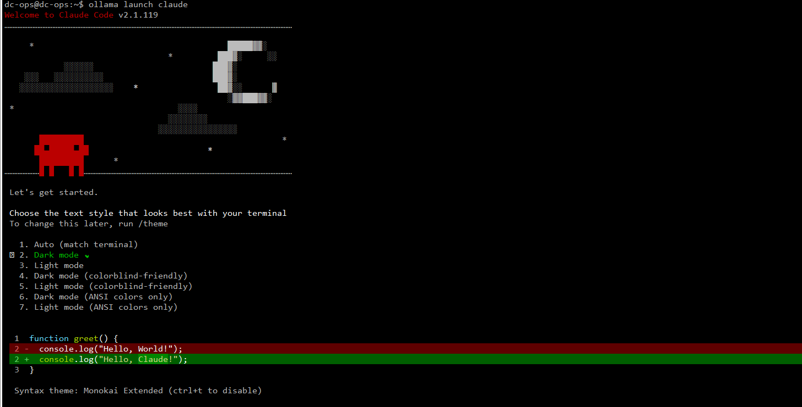

**Step 12.10: (Optional) Run with a Fixed Model**
```Shell
ollama launch claude --model qwen3.5:cloud
```
*For non‑interactive / CI mode:*
```Shell
ollama launch claude --model qwen3.5:cloud --yes -- -p "explain this repo"
```

## 🌉 Step 13: Configure Terraform MCP Server

### 13.1 Create Docker network (optional but recommended)

```bash
docker network create terraform-network
```

This allows containers to communicate if needed.

### 13.2 Pull the Terraform MCP Server image

```bash
docker pull hashicorp/terraform-mcp-server
```

Monitor the download:
```bash
# Get image details
docker images | grep terraform-mcp-server
```
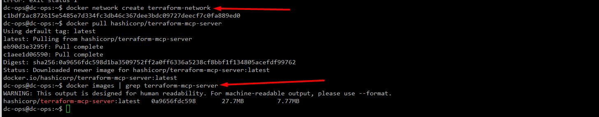
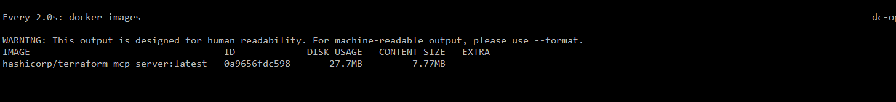

---

## 🔗 Step 14: Configure MCP in Claude Code

### 14.1 Open VS Code settings

Press `Ctrl+,` (or go to **File → Preferences → Settings**)

### 14.2 Open settings.json

Click the icon in the top-right (looks like `{}`) to open JSON settings.

### 14.3 Add MCP configuration

Add this section to your `settings.json`:

```json
"claude-dev.mcpServers": {
  "terraform": {
    "command": "docker",
    "args": [
      "run",
      "--rm",
      "-e", "TF_TOKEN_app_terraform_io=YOUR_TOKEN_HERE",
      "-e", "TF_API_ADDRESS=https://app.terraform.io",
      "hashicorp/terraform-mcp-server"
    ]
  }
}
```

**Replace `YOUR_TOKEN_HERE`** with your Terraform Cloud token.

### 14.4 Save settings

Press `Ctrl+S` to save.

### 14.5 Restart VS Code

Close and reopen VS Code for changes to take effect.

---

## ✅ Step 15: Verify Everything Works

### 15.1 Check Docker is running

```bash
docker ps
```

Should show container status (even if empty).

### 15.2 Test Docker with Terraform image

```bash
docker run --rm hashicorp/terraform-mcp-server --version
```

Should output Terraform version info.

### 15.3 Check Terraform CLI

```bash
terraform -version
```

### 15.4 Test AWS CLI

```bash
aws sts get-caller-identity
```

Should return your AWS account info (if configured).

### 15.5 Verify Claude Code in VS Code

1. Open VS Code
2. Click the Claude icon in the sidebar
3. You should see the Claude Code interface
4. Try typing a simple prompt to test connectivity

---

## 🧪 Step 16: Test the Full Setup

### 16.1 Create a test Terraform project

```bash
mkdir -p ~/terraform-test
cd ~/terraform-test
```

### 16.2 Create a test file

```bash
cat > main.tf << EOF
terraform {
  cloud {
    organization = "YOUR_ORG"  # Change this to your Terraform Cloud org
    hostname     = "app.terraform.io"

    workspaces {
      name = "mcp-test"
    }
  }

  required_version = ">= 1.0"
}

provider "aws" {
  region = "us-east-1"
}

# We'll have Claude generate a resource here
EOF
```

### 16.3 Test with Claude Code

1. Open the `main.tf` file in VS Code
2. Open Claude Code panel (click Claude icon)
3. Ask: **"Generate an S3 bucket resource with current best practices"**
4. Claude should use live Terraform schemas to generate accurate code

### 16.4 Validate the generated code

```bash
terraform init
terraform plan
```

If you get a valid plan output (even if empty), your setup is working! ✅

---

## 🧠 Step 17: Integrate Ollama with Claude Code (Optional)

### 17.1 Why use Ollama with Claude Code?

Here's the deal: you've got three LLM options now:

| Option | Pros | Cons |
|--------|------|------|
| **Claude (Cloud)** | Most capable, latest models, best Terraform knowledge | Requires internet, API costs, rate limits |
| **Qwen via Ollama (Local)** | Fast, zero costs, works offline, no rate limits | Less capable than Claude, smaller context window |
| **Hybrid** | Use Claude for complex tasks, Ollama for quick tests | Requires manual switching |

Many developers use Ollama locally for quick code generation, testing, and offline work. It's also great for learning without hitting API limits.

### 17.2 Configure Ollama as MCP Server (Optional)

If you want Claude Code to use Ollama's Qwen model, you can add it as an MCP server. This is optional—you can also just run Ollama separately.

**Note:** Currently, Ollama doesn't have an official MCP server wrapper, but you can use it directly:

### 17.3 Use Ollama from the command line

You already have Ollama running. Test it directly:

```bash
ollama run qwen3.5:cloud "Write a Terraform resource for an AWS security group"
```

The model will respond with code. No API calls, no internet required.

### 17.4 Set up Ollama web interface (Optional)

Ollama includes a local web UI:

1. Open browser: http://localhost:11434
2. You should see the Ollama interface
3. Select **qwen3.5:cloud** from the dropdown
4. Chat directly with the model

### 17.5 Use Ollama for quick testing

**Workflow idea:**
1. Use Claude Code for complex infrastructure planning
2. Use local Ollama for quick Terraform syntax checking
3. Validate with `terraform plan` before applying

This saves API costs and lets you work offline.

### 17.6 Monitor Ollama performance

Check what's running on your system:

```bash
# See running Ollama processes
ps aux | grep ollama

# Check memory usage
free -h

# Monitor GPU usage (if you have NVIDIA)
nvidia-smi
```

**Pro tip:** Qwen 3.5 Cloud is optimized for CPU inference but will use GPU if available (CUDA on NVIDIA, Metal on Mac).

---

## 🛠️ Troubleshooting Common Issues

### Docker permission denied

**Error:** `permission denied while trying to connect to Docker daemon`

**Solution:**
```bash
# Make sure you logged out and back in after Step 2.6
# Or restart your system
sudo systemctl restart docker
```

### Terraform token not found

**Error:** `401 Unauthorized`

**Solution:**
```bash
# Verify token is set
cat ~/.terraform.d/credentials.tfrc.json

# Test token manually
terraform login
```

### MCP Server not connecting

**Error:** `Failed to connect to MCP server`

**Solution:**
1. Verify Docker is running: `docker ps`
2. Check token in VS Code settings
3. Restart VS Code
4. Check VS Code output panel for errors

### AWS credentials not working

**Error:** `InvalidUserID.NotFound` or `UnauthorizedOperation`

**Solution:**
```bash
# Verify AWS credentials
aws sts get-caller-identity

# If not configured, run:
aws configure
```

### Ollama service not running

**Error:** `Error: connect ECONNREFUSED 127.0.0.1:11434`

**Solution:**
```bash
# Start Ollama service
sudo systemctl start ollama

# Check status
systemctl status ollama

# View logs
sudo journalctl -u ollama -n 50
```

### Ollama model not responding

**Error:** Model returns nothing or times out

**Solution:**
```bash
# Kill any stuck processes
pkill -f ollama

# Start fresh
sudo systemctl restart ollama

# Wait 5 seconds for startup
sleep 5

# Test again
curl http://localhost:11434/api/tags
```

### Qwen model running slow

**Why:** Models run on CPU by default if no GPU available.

**Solution:**
```bash
# Check available resources
free -h

# For faster inference, consider:
# 1. Upgrade system RAM (Qwen needs ~4GB minimum)
# 2. Install GPU drivers if you have NVIDIA
# 3. Use smaller model variants (if available)

# Current model check
ollama list

# Stop running model
pkill ollama
```

### Model file not found after pull

**Error:** `model 'qwen3.5:cloud' not found`

**Solution:**
```bash
# Models live here
ls -lah ~/.ollama/models/

# Re-pull if missing
ollama pull qwen3.5:cloud

# Verify it exists
ollama list
```

---

## 📊 Final Verification Checklist

- [ ] Docker installed and running: `docker --version`
- [ ] Terraform installed: `terraform --version`
- [ ] AWS CLI installed: `aws --version`
- [ ] Ollama installed and running: `systemctl status ollama`
- [ ] Qwen model pulled: `ollama list`
- [ ] Terraform token configured: `cat ~/.terraform.d/credentials.tfrc.json`
- [ ] VS Code installed: `code --version`
- [ ] Claude Code extension installed (visible in VS Code)
- [ ] MCP configuration added to VS Code settings
- [ ] Docker image pulled: `docker images | grep terraform`
- [ ] Ollama API accessible: `curl http://localhost:11434/api/tags`
- [ ] Test terraform plan runs without errors

---

## 🎯 Next Steps

1. **Start a new Terraform project** in VS Code
2. **Use Claude Code** to generate Terraform resources
3. **Run `terraform plan`** to validate the generated code
4. **Review and merge** before applying

---

## 📚 Useful Commands Reference

```bash
# Docker
docker ps                           # List running containers
docker images                       # List downloaded images
docker pull hashicorp/terraform-mcp-server  # Pull latest image

# Terraform
terraform version                   # Check version
terraform init                      # Initialize working directory
terraform plan                      # Preview changes
terraform apply                     # Apply changes
terraform destroy                   # Destroy resources
terraform login                     # Set up Terraform Cloud token

# AWS CLI
aws sts get-caller-identity         # Check AWS credentials
aws configure                       # Configure AWS access keys
aws s3 ls                          # List S3 buckets (test command)

# Ollama
ollama --version                    # Check Ollama version
ollama pull qwen3.5:cloud          # Download Qwen model
ollama list                         # List downloaded models
ollama run qwen3.5:cloud            # Start interactive chat
ollama serve                        # Start Ollama server manually
systemctl status ollama             # Check if Ollama service is running
systemctl start ollama              # Start Ollama service
systemctl stop ollama               # Stop Ollama service
curl http://localhost:11434/api/tags  # Check Ollama API

# VS Code
code .                             # Open current directory in VS Code
code filename                      # Open specific file
```

---

## 💡 Pro Tips

**✅ Security Best Practices:**
- Never commit tokens to Git
- Use `.gitignore` to exclude `credentials.tfrc.json`
- Rotate tokens regularly
- Use separate tokens for different projects

**✅ Performance Tips:**
- Docker images cache locally after first pull
- Use `terraform workspace` for environment separation
- Set up remote state in Terraform Cloud
- Ollama runs on CPU by default—give it at least 4GB RAM
- Monitor Ollama memory with `free -h`

**✅ Workflow Tips:**
- Use `.terraform-docs.yaml` for documentation
- Run `terraform fmt` before commits
- Use `terraform validate` to check syntax
- Keep Claude Code prompts specific and clear
- Use Ollama locally for quick syntax checks (saves API costs)
- Use Claude Code for complex infrastructure planning
- Combine both: Ollama for drafts, Claude for refinement

**✅ Ollama-Specific Tips:**
- Ollama serves on `localhost:11434`—keep it running in background
- Run `ollama list` to see available models
- Each model takes different amounts of RAM (qwen3.5:cloud ≈ 2-4GB)
- For faster responses, keep model in memory: `ollama run qwen3.5:cloud`
- Models live in `~/.ollama/models/`—backup if needed
- Check logs: `sudo journalctl -u ollama -f` (live tail)

---

## 📞 Getting Help

If you get stuck:

1. **Check the error message** carefully
2. **Verify each component** works independently
3. **Check Docker logs:** `docker logs container_id`
4. **Check VS Code output:** View → Output (select "Claude" from dropdown)
5. **Check Terraform logs:** `TF_LOG=DEBUG terraform plan`

---

**OS:** Ubuntu 22.04 LTS  
**Stack:** Docker + Terraform + AWS CLI + Claude Code for VS Code + Ollama (Qwen 3.5 Cloud)  

---

## 📊 My Complete Setup Summary

### What I've Installed:

| Component | Purpose | Status |
|-----------|---------|--------|
| **Ubuntu 22.04 LTS** | Base OS | ✅ |
| **Docker** | Container runtime (MCP Server) | ✅ |
| **Terraform** | IaC tool | ✅ |
| **AWS CLI** | Cloud interaction | ✅ |
| **Ollama** | Local LLM runtime | ✅ |
| **Qwen 3.5 Cloud** | Local AI model | ✅ |
| **VS Code** | Code editor | ✅ |
| **Claude Code (Extension)** | AI coding in VS Code | ✅ |
| **Terraform MCP Server** | Live schema bridge | ✅ |

### LLM Options I Now Have:

1. **Claude Code (Cloud)** → Best quality, requires internet, API costs
2. **Ollama + Qwen (Local)** → Fast, free, works offline, good for Terraform
3. **Hybrid** → Use both strategically

---
## 🏁 Conclusion

This project demonstrates that **powerful AI development does not require expensive subscriptions**. By combining **Claude Code**, **Ollama**, and **Minimax M2.7**, you get a production-ready AI coding workflow at **zero cost**.

Use this setup to build, experiment, and innovate faster—without limits.
---


## 🎓 Learning Resources

- **Terraform Docs:** https://www.terraform.io/docs
- **Terraform Cloud:** https://app.terraform.io/
- **Docker Documentation:** https://docs.docker.com/
- **Docker Installtation:** https://docs.docker.com/engine/install/ubuntu/
- **AWS CLI Reference:** https://docs.aws.amazon.com/cli/
- **VS Code Docs:** https://code.visualstudio.com/docs


--Ref Link

- Youtube
  - [Use Claude Code FREE with Ollama ](https://www.youtube.com/watch?v=xMHG9pXlCpg&list=PLJcpyd04zn7oj5YyplnmW6GrkXm9LlUYq&index=12)

https://www.youtube.com/watch?v=JC12VC7bpQk&list=PLJcpyd04zn7r8JWlF22m7W7lCxl1h2woN&index=4

https://developer.hashicorp.com/terraform/mcp-server

https://modelcontextprotocol.io/docs/getting-started/intro

https://developer.hashicorp.com/terraform/mcp-server/deploy

https://docs.docker.com/desktop/setup/install/windows-install/

https://app.terraform.io/app/settings


