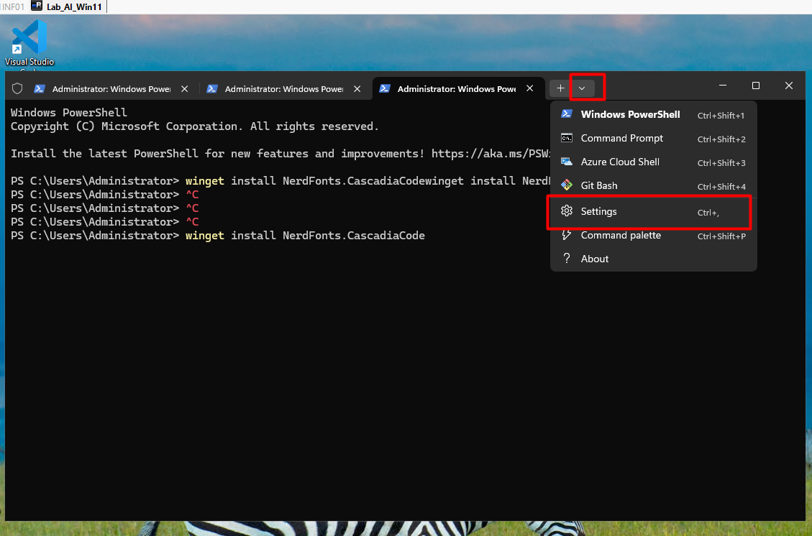
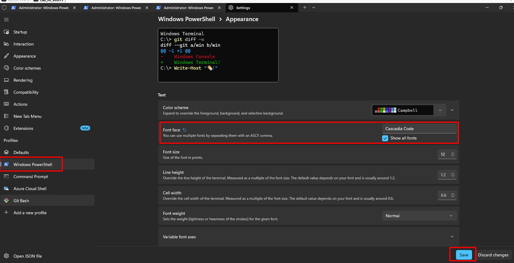

# Claude Code + UV Proxy + NVIDIA Token Dynamic Statusline Setup (Windows 11)

## Overview

This guide helps you build a professional AI engineering terminal statusline on Windows 11 using:

- Claude Code
- UV Proxy
- NVIDIA Token/API
- PowerShell 7
- Starship Prompt

The statusline automatically displays:

- Current folder
- Git branch
- Active AI model
- Token usage
- Token reset timer
- Current time

Example:

```text
📁 playground 🌱 main 🤖 claude-sonnet-4-6 📊 72% ⏳ 10m 🕒 07:40 PM
❯
```

---

# Architecture

| Component | Purpose |
|---|---|
| Starship | Terminal statusline |
| PowerShell 7 | Modern shell |
| Python scripts | Dynamic status data |
| Claude Code | AI CLI |
| UV | Python runtime |
| NVIDIA Token | API provider |
| Nerd Font | Icons rendering |

---

# Prerequisites

- Windows 11
- Administrator access
- PowerShell
- Python installed
- Claude Code installed
- UV installed

---

# STEP 1 — Install PowerShell 7

Open PowerShell as Administrator:

```powershell
winget install Microsoft.PowerShell
```

Launch PowerShell 7:

```powershell
pwsh
```

Verify:

```powershell
$PSVersionTable.PSVersion
```

---

# STEP 2 — Install Starship Prompt

```powershell
winget install Starship.Starship
```

Verify:

```powershell
starship --version
```

---

# STEP 3 — Install Nerd Font

Install Cascadia Nerd Font:

```powershell
winget install NerdFonts.CascadiaCode
```

---

# STEP 4 — Configure Windows Terminal Font

Open:

```text
Windows Terminal → Settings → PowerShell → Appearance
```


Select:

```text
CaskaydiaCove Nerd Font
```

Save settings.



---

# STEP 5 — Configure PowerShell Profile

Open PowerShell profile:

```powershell
notepad $PROFILE
```

If prompted to create the file, click YES.

Add:

```powershell
Invoke-Expression (&starship init powershell)
```

Optional:

Automatically export model name:

```powershell
$env:AI_MODEL="claude-sonnet-4-6"
```

Save and close.

---

# STEP 6 — Create Config Directory

```powershell
mkdir $HOME\.config -Force
```

---

# STEP 7 — Create Dynamic Model Detection Script

Create file:

```powershell
notepad $HOME\.config\model.py
```

Paste:

```python
import os
import json
from pathlib import Path

possible_vars = [
    "ANTHROPIC_MODEL",
    "MODEL",
    "AI_MODEL",
    "CLAUDE_MODEL",
    "OPENAI_MODEL"
]

for var in possible_vars:
    value = os.getenv(var)
    if value:
        print(value)
        exit(0)

possible_files = [
    Path.home() / ".claude" / "config.json",
    Path.home() / ".config" / "claude" / "config.json",
    Path.home() / ".uv" / "config.json"
]

for file in possible_files:
    if file.exists():
        try:
            data = json.loads(file.read_text())

            for key in ["model", "default_model"]:
                if key in data:
                    print(data[key])
                    exit(0)

        except:
            pass

print("Unknown-Model")
```

Save file.

---

# STEP 8 — Test Model Detection

Run:

```powershell
python $HOME\.config\model.py
```

Expected output:

```text
claude-sonnet-4-6
```

---

# STEP 9 — Create Token Usage Script

Create file:

```powershell
notepad $HOME\.config\tokens.py
```

Paste:

```python
import random

# Replace later with actual NVIDIA/Claude usage parsing
print("72%")
```

Save file.

---

# STEP 10 — Create Reset Timer Script

Create file:

```powershell
notepad $HOME\.config\reset_timer.py
```

Paste:

```python
print("10m")
```

Save file.

---

# STEP 11 — Create Starship Configuration

Open:

```powershell
notepad $HOME\.config\starship.toml
```

Paste:

```toml
format = """
$directory\
$git_branch\
$custom.model\
$custom.tokens\
$custom.reset\
$time
$character
"""

[directory]
style = "bold cyan"
truncate_to_repo = false

[git_branch]
symbol = "🌱 "
style = "bold purple"

[time]
disabled = false
time_format = "%I:%M %p"
style = "bold red"

[character]
success_symbol = "[❯](bold green)"
error_symbol = "[❯](bold red)"

# MODEL
[custom.model]
command = "python $HOME\\.config\\model.py"
when = "true"
style = "bold yellow"
format = "[🤖 $output]($style) "

# TOKEN %
[custom.tokens]
command = "python $HOME\\.config\\tokens.py"
when = "true"
style = "bold green"
format = "[📊 $output]($style) "

# RESET TIMER
[custom.reset]
command = "python $HOME\\.config\\reset_timer.py"
when = "true"
style = "bold blue"
format = "[⏳ $output]($style) "
```

Save file.

---

# STEP 12 — Restart Terminal

Close terminal completely.

Open new PowerShell 7 terminal:

```powershell
pwsh
```

Expected result:

```text
📁 playground 🌱 main 🤖 claude-sonnet-4-6 📊 72% ⏳ 10m 🕒 07:40 PM
❯
```

---

# Optional — Dynamic NVIDIA Token Tracking

Replace `tokens.py` with:

```python
import json
from pathlib import Path

usage_file = Path.home() / ".uv" / "usage.json"

if usage_file.exists():
    data = json.loads(usage_file.read_text())
    print(f"{data['used_percent']}%")
else:
    print("0%")
```

---

# Optional — Dynamic Reset Timer

Replace `reset_timer.py` with:

```python
from datetime import datetime, timedelta

reset_time = datetime.now() + timedelta(minutes=10)
remaining = reset_time - datetime.now()

minutes = int(remaining.total_seconds() // 60)

print(f"{minutes}m")
```

---

# Troubleshooting

## Starship Not Loading

Verify profile contains:

```powershell
Invoke-Expression (&starship init powershell)
```

Reload profile:

```powershell
. $PROFILE
```

---

## Icons Not Showing Properly

Ensure:

- Nerd Font installed
- Windows Terminal font set correctly

---

## Python Not Found

Install Python:

```powershell
winget install Python.Python.3.12
```

Verify:

```powershell
python --version
```

---

# Recommended Final Setup

| Tool | Recommended |
|---|---|
| Shell | PowerShell 7 |
| Prompt | Starship |
| Terminal | Windows Terminal |
| Font | CaskaydiaCove Nerd Font |
| AI CLI | Claude Code |
| Runtime | UV |

---

# Useful Commands

Reload PowerShell profile:

```powershell
. $PROFILE
```

Open Starship config:

```powershell
notepad $HOME\.config\starship.toml
```

Test model script:

```powershell
python $HOME\.config\model.py
```

---

# Final Result

You now have a professional dynamic AI-engineer terminal prompt with:

- Auto model detection
- Token usage display
- Reset timer
- Current folder
- Git branch
- Modern terminal UI

Perfect for Claude Code + UV + NVIDIA workflows on Windows 11.
