# One Repo, Multiple Branches, Zero Context Switching: Git Worktree Explained
<!-- # Git Worktree: The Git Feature Every DevOps Engineer Should Be Using -->


> Stop cloning the same repository multiple times. Learn how Git Worktree lets you work on multiple branches simultaneously without interrupting your workflow.

---

## Introduction

If you've been working with Git for a while, you've probably experienced this situation:

You're halfway through implementing a new feature when an urgent production issue is reported. You need to switch to the production branch immediately, but your current work isn't ready to commit.

Most developers usually choose one of these options:

- Commit unfinished code
- Stash the changes
- Create another clone of the repository
- Copy the project into another folder

While these approaches work, they interrupt your development flow and often create unnecessary overhead.

Fortunately, Git provides a much cleaner solution called **Git Worktree**.

# The problem it solves

A normal git repo gives you one working directory tied to one `.git` folder. Switch branches, and your working directory rewrites itself in place. That's fine until you need to be in two places at once — running a long test suite on `feature/x` while also patching `hotfix/y`, or keeping a stable build of `main` around for reference while you're deep in a rewrite.

`git worktree` lets you check out multiple branches into separate directories simultaneously, all backed by the same `.git` repository. No re-cloning, no duplicated object store, no stash juggling.

# How it actually works under the hood

This is the part that made it stick for me. A worktree isn't a copy of your repo — it's a second working directory that shares the object database, refs, and index metadata with the original clone. Git tracks each linked worktree's administrative data under `.git/worktrees/<name>/`, which holds its own `HEAD`, `index`, and `ORIG_HEAD` — but the commit objects, packfiles, and branch refs stay centralized. That's why a commit made in one worktree is visible to every other worktree instantly. There's nothing to fetch, pull, or sync.


---

# What is Git Worktree?

A Git Worktree allows you to create multiple working directories from a single Git repository.

Each worktree has:
- Its own checked-out branch
- Independent working files
- Separate build artifacts
- Separate terminal session
- Independent IDE window

All worktrees share the same Git repository objects, commit history, branches, and tags.

---
# Architecture Flow

```mermaid
flowchart LR

%% =========================
%% Development Layer
%% =========================

subgraph DEV["👨‍💻 Development Layer"]
    A[Developer]
    B[Git Repository]
    C1[Main Branch]
    C2[Feature Branch]
    D[Git Worktree<br/>Isolated Working Directory]
    E[Local Development<br/>Testing]
end

%% =========================
%% CI/CD Layer
%% =========================

subgraph CICD["⚙️ CI/CD Pipeline"]
    F[Commit & Push]
    G[GitHub Actions / Jenkins]

    H1[Build<br/>Maven / Gradle / Node.js]
    H2[Security Scan<br/>Trivy / Gitleaks]
    H3[Code Quality<br/>SonarQube]

    I[Artifact Registry<br/>ECR / Nexus / Docker Hub]
    J[Deployment Stage]
end

%% =========================
%% Infrastructure Layer
%% =========================

subgraph IAC["☁️ Infrastructure as Code"]
    K[Terraform Plan]
    L[Terraform Apply]
end

%% =========================
%% Cloud Layer
%% =========================

subgraph CLOUD["🌐 Cloud Platform"]
    M[AWS / Azure]
    N[EKS / EC2 / RDS]
    O[VPC / IAM / Security Groups]
    P[Monitoring<br/>CloudWatch / Grafana]
end

%% Flow
A --> B

B --> C1
B --> C2

C2 --> D
D --> E

E --> F

F --> G

G --> H1
G --> H2
G --> H3

H1 --> I
H2 --> I
H3 --> I

I --> J

J --> K
K --> L

L --> M

M --> N
M --> O
N --> P

%% Styling

classDef developer fill:#E3F2FD,stroke:#1565C0,color:#000
classDef git fill:#FFF3E0,stroke:#FB8C00,color:#000
classDef cicd fill:#E8F5E9,stroke:#2E7D32,color:#000
classDef terraform fill:#F3E5F5,stroke:#6A1B9A,color:#000
classDef cloud fill:#ECEFF1,stroke:#37474F,color:#000

class A developer
class B,C1,C2,D,E git
class F,G,H1,H2,H3,I,J cicd
class K,L terraform
class M,N,O,P cloud
```



---


# Problem Without Worktrees

You constantly switch branches:

```bash
git checkout main
git stash
git checkout hotfix
```

This becomes repetitive and error-prone.

---

# Solution: Git Worktree

Create multiple working directories:

```bash
git worktree add ../project-hotfix hotfix/login-fix
git worktree add ../project-feature feature/user-auth
```

Now you can work in parallel.

---

# Create a Worktree

```bash
cd project
git worktree add ../project-feature feature/user-authentication
```

Now you have:
- project/ (main)
- project-feature/ (feature branch)

---

# Create New Branch + Worktree

```bash
git worktree add -b feature/payment-api ../project-payment
```

---

# List Worktrees

```bash
git worktree list
```

---

# Remove Worktree

```bash
git worktree remove ../project-feature
```

---

# Clean Stale Worktrees

```bash
git worktree prune
```

---

# Real-world DevOps Example

While working on Terraform feature development:

```bash
git worktree add ../terraform-hotfix hotfix/iam-policy
```

Fix production issue without disturbing ongoing work.

---

# Best Practices

- One worktree per active branch
- Use meaningful folder names
- Remove unused worktrees
- Use separate IDE windows per worktree

---

# Git Clone vs Worktree

| Feature | Clone | Worktree |
|--------|------|----------|
| Disk usage | High | Low |
| Speed | Slow | Fast |
| Multiple branches | Yes | Yes |
| Duplicate repo | Yes | No |

---

# A few gotchas worth knowing

- **You can't check out the same branch in two worktrees at once.** Git blocks it to prevent divergent commits against the same ref — it'll tell you the branch is already checked out elsewhere.
- **Submodules need extra care.** Older git versions didn't handle submodules cleanly across worktrees; newer versions are better, but it's worth testing before you rely on it in a submodule-heavy repo.
- **Disk usage isn't free**, even though the object store is shared — each worktree still has its own full working copy of tracked files.
- **CI runners can exploit this too.** Spinning up a worktree per job instead of a fresh clone cuts down on network and disk I/O when you're running matrix builds against the same repo.

---

# Final Thoughts

Git Worktree improves productivity by eliminating constant branch switching. It is especially useful for DevOps engineers, platform engineers, and developers working on multiple parallel tasks.

---

# 📺 Watch Full Video

[](https://www.youtube.com/watch?v=Vf_0QpLsFRs&list=PL4cUxeGkcC9iUtQh7Aja3TGfbdd7Z-K0W)

---

Reference:
https://git-scm.com/docs/git-worktree


